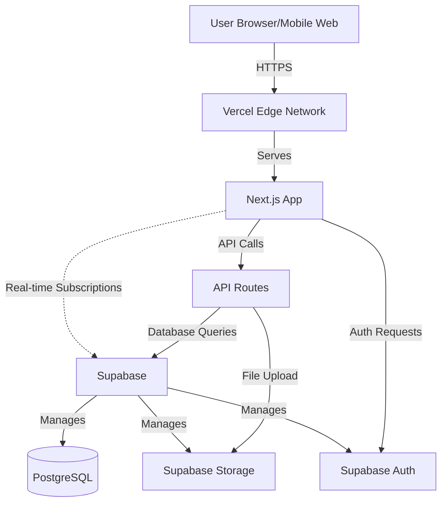
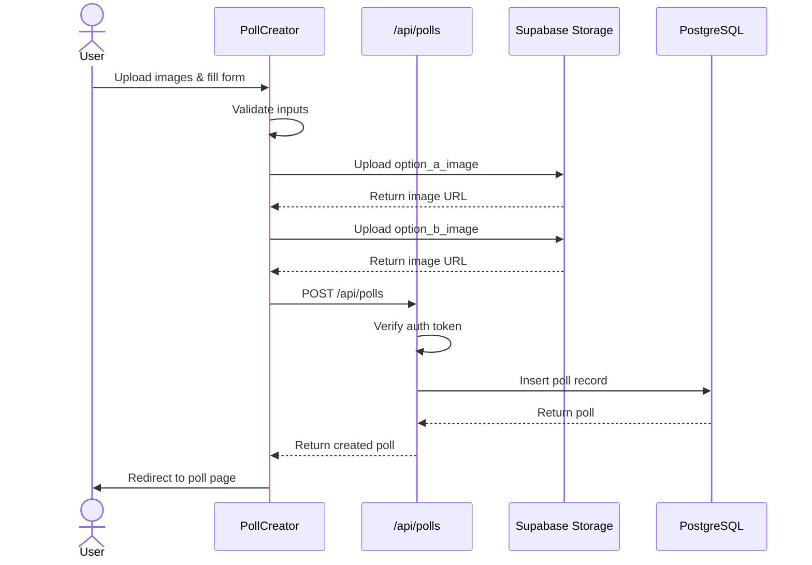
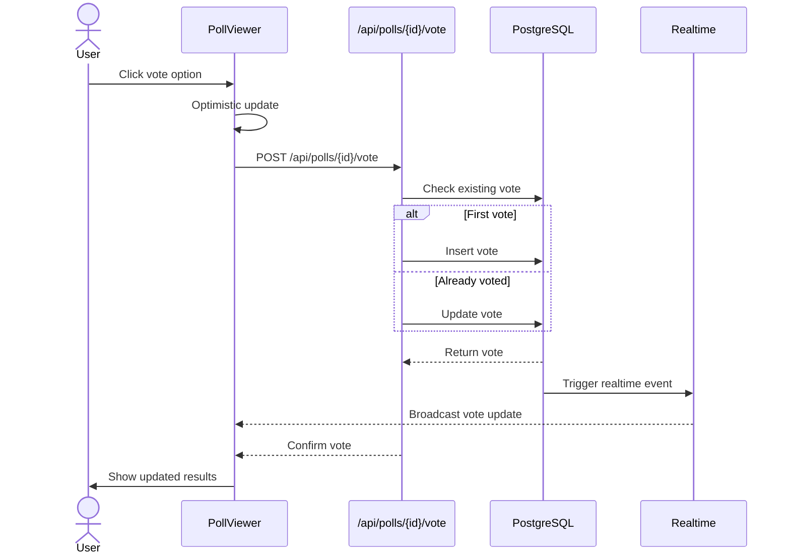
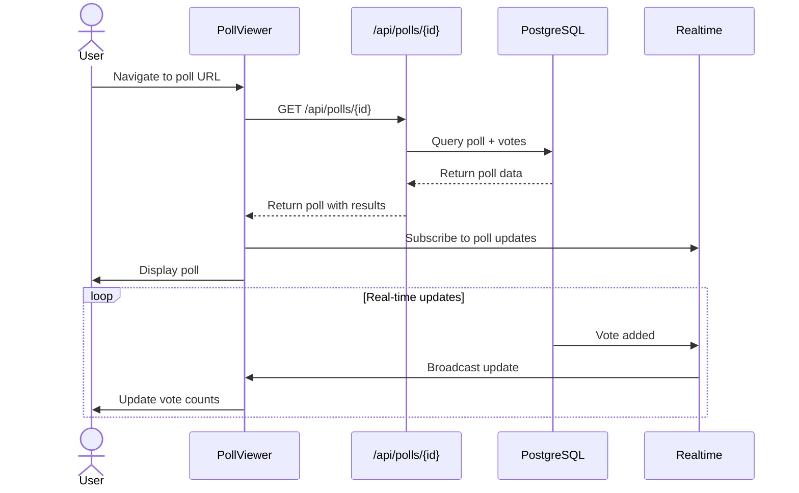
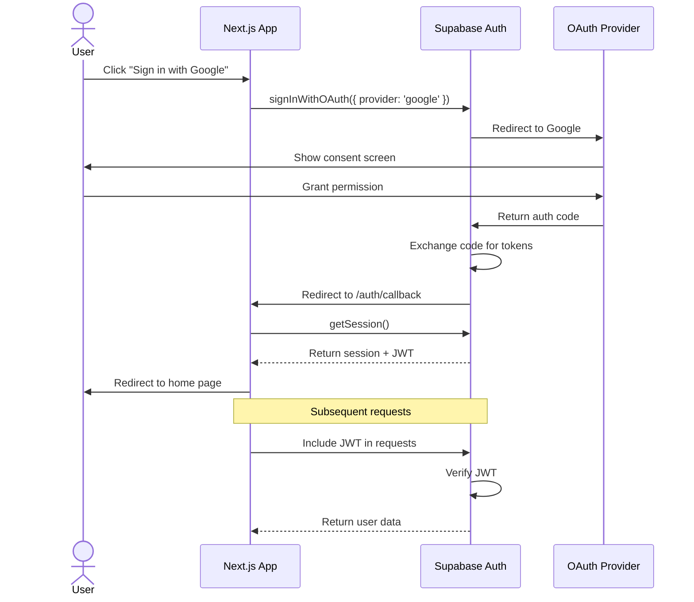
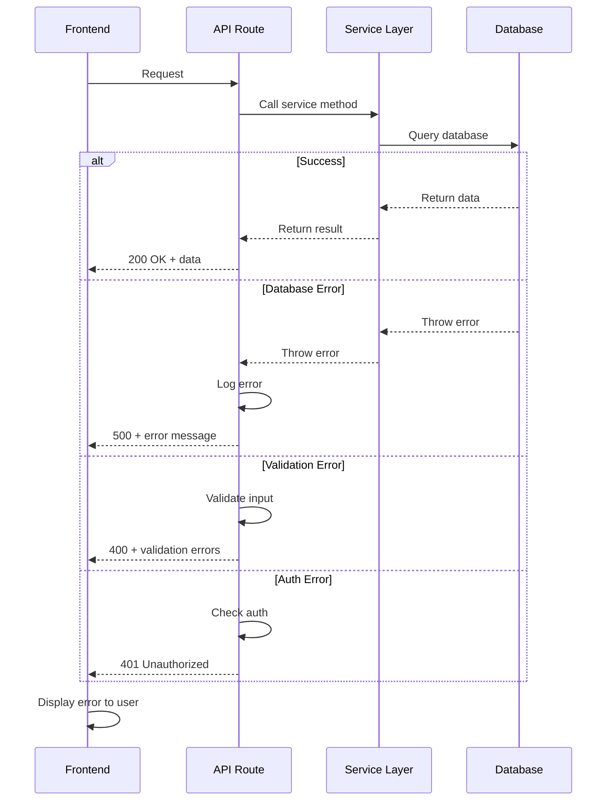

# ThisOrThat Fullstack Architecture Document

## Introduction

This document outlines the complete fullstack architecture for ThisOrThat, including backend systems, frontend implementation, and their integration. It serves as the single source of truth for AI-driven development, ensuring consistency across the entire technology stack.

This unified approach combines what would traditionally be separate backend and frontend architecture documents, streamlining the development process for modern fullstack applications where these concerns are increasingly intertwined.

### Starter Template or Existing Project

**N/A - Greenfield project**

We will use Next.js 14+ with the App Router as our foundation, deployed on Vercel with Supabase as our backend-as-a-service platform.

### Change Log

| Date | Version | Description | Author |
|------|---------|-------------|--------|
| 2025-01-27 | 1.0 | Initial architecture document | ThisOrThat Team |

## High Level Architecture

### Technical Summary

ThisOrThat is built as a modern Jamstack application using Next.js 14+ with the App Router, deployed on Vercel's edge network for optimal performance. The frontend leverages React Server Components for improved performance and SEO, while the backend utilizes Supabase for authentication, database, and real-time functionality. The architecture follows a serverless approach with API routes handling business logic and Supabase Edge Functions for complex operations. This stack enables rapid development with built-in authentication, real-time updates for poll voting, and automatic scaling to handle viral growth. The architecture achieves the PRD goals of creating a fast, responsive polling platform that works seamlessly on web and mobile web, with invite-only access control and content moderation capabilities.

### Platform and Infrastructure Choice

**Platform:** Vercel + Supabase

**Key Services:**
- **Vercel**: Frontend hosting, serverless API routes, edge functions, automatic deployments
- **Supabase**: PostgreSQL database, authentication (Google/Facebook OAuth), real-time subscriptions, storage for poll images, row-level security
- **Vercel Edge Network**: Global CDN for static assets and image optimization
- **Supabase Storage**: Image uploads and serving with automatic optimization

**Deployment Host and Regions:** 
- Vercel: Global edge network with automatic region selection
- Supabase: US-West (primary), with potential for multi-region expansion

**Rationale:**
- Vercel + Supabase is the optimal choice for rapid MVP development with built-in scaling
- Zero DevOps overhead - focus on product development
- Built-in authentication and real-time capabilities perfect for polling
- Generous free tiers for early development
- Automatic HTTPS, CDN, and image optimization
- Strong TypeScript support across the stack

### Repository Structure

**Structure:** Monorepo (single repository)

**Monorepo Tool:** npm workspaces (built into npm 7+)

**Package Organization:**
```
thisorthat/
├── apps/
│   └── web/                 # Next.js application (frontend + API routes)
├── packages/
│   ├── shared/             # Shared types, constants, utilities
│   └── ui/                 # Shared UI components (future)
└── supabase/               # Supabase configuration and migrations
```

**Rationale:**
- Simple monorepo structure using npm workspaces (no additional tooling needed)
- Next.js App Router colocates frontend and API routes naturally
- Shared package for TypeScript types used across frontend and backend
- Supabase folder for database migrations and edge functions

### High Level Architecture Diagram



### Architectural Patterns

- **Jamstack Architecture:** Static site generation with serverless APIs and real-time database - _Rationale:_ Optimal performance, security, and scalability for content-driven applications with dynamic features
- **Server Components First:** Use React Server Components by default, Client Components only when needed - _Rationale:_ Reduced JavaScript bundle size, improved performance, better SEO
- **API Route Handlers:** Next.js App Router API routes for backend logic - _Rationale:_ Colocated with frontend, serverless execution, TypeScript end-to-end
- **Row-Level Security (RLS):** Supabase RLS policies for data access control - _Rationale:_ Security enforced at database level, prevents unauthorized access
- **Optimistic UI Updates:** Update UI immediately, sync with server in background - _Rationale:_ Improved perceived performance for voting and comments
- **Edge-First Rendering:** Leverage Vercel Edge Functions for dynamic content - _Rationale:_ Low latency worldwide, improved user experience
- **Repository Pattern:** Abstract database access through service layer - _Rationale:_ Testability and potential future migration flexibility

## Tech Stack

### Technology Stack Table

| Category | Technology | Version | Purpose | Rationale |
|----------|-----------|---------|---------|-----------|
| Frontend Language | TypeScript | 5.3+ | Type-safe development | Industry standard, catches errors at compile time, excellent IDE support |
| Frontend Framework | Next.js | 14+ (App Router) | React framework with SSR/SSG | Best-in-class React framework, built-in routing, API routes, image optimization |
| UI Component Library | Shadcn/ui | Latest | Accessible component library | Customizable, accessible, built on Radix UI, Tailwind-based |
| State Management | React Context + Hooks | Built-in | Client-side state | Sufficient for MVP, no additional dependencies needed |
| Backend Language | TypeScript | 5.3+ | Type-safe API development | Same language as frontend, shared types |
| Backend Framework | Next.js API Routes | 14+ | Serverless API endpoints | Colocated with frontend, automatic deployment, TypeScript support |
| API Style | REST | N/A | HTTP API endpoints | Simple, well-understood, sufficient for MVP |
| Database | PostgreSQL (Supabase) | 15+ | Relational database | ACID compliance, JSON support, excellent for structured data |
| Cache | Vercel Edge Cache | Built-in | CDN caching | Automatic, no configuration needed |
| File Storage | Supabase Storage | Latest | Image uploads | Built-in with Supabase, automatic optimization, CDN delivery |
| Authentication | Supabase Auth | Latest | User authentication | OAuth providers, JWT tokens, email verification |
| Frontend Testing | Vitest + React Testing Library | Latest | Component testing | Fast, modern, great TypeScript support |
| Backend Testing | Vitest | Latest | API route testing | Same test runner as frontend, consistency |
| E2E Testing | Playwright | Latest | End-to-end testing | Cross-browser, reliable, great for critical user flows |
| Build Tool | Next.js | 14+ | Application bundler | Built-in, optimized for production |
| Bundler | Turbopack | Built-in Next.js | Fast bundling | Next.js default, faster than Webpack |
| IaC Tool | Vercel CLI + Supabase CLI | Latest | Infrastructure management | Declarative configuration, version controlled |
| CI/CD | GitHub Actions + Vercel | Latest | Automated deployment | Free for public repos, integrates with Vercel |
| Monitoring | Vercel Analytics | Built-in | Performance monitoring | Real user metrics, Core Web Vitals |
| Logging | Vercel Logs + Supabase Logs | Built-in | Application logging | Centralized logging, searchable |
| CSS Framework | Tailwind CSS | 3.4+ | Utility-first CSS | Rapid styling, consistent design system, small bundle size |

## Data Models

### User

**Purpose:** Represents a user account in the system

**Key Attributes:**
- id: UUID - Unique identifier (from Supabase Auth)
- email: string - User email address
- display_name: string - User's display name
- avatar_url: string | null - Profile picture URL
- created_at: timestamp - Account creation date
- updated_at: timestamp - Last profile update

**TypeScript Interface:**
```typescript
interface User {
  id: string;
  email: string;
  display_name: string;
  avatar_url: string | null;
  created_at: string;
  updated_at: string;
}
```

**Relationships:**
- One user can create many Polls
- One user can create many Votes
- One user can create many Comments

### Poll

**Purpose:** Represents a This or That poll with two options

**Key Attributes:**
- id: UUID - Unique identifier
- creator_id: UUID - Foreign key to User
- option_a_image_url: string - URL to first option image
- option_a_label: string | null - Optional label for option A
- option_b_image_url: string - URL to second option image
- option_b_label: string | null - Optional label for option B
- description: string | null - Optional poll description
- expires_at: timestamp - When poll closes (24 hours from creation)
- is_public: boolean - Whether poll is public or friend-group only
- status: enum - 'active' | 'closed' | 'deleted'
- created_at: timestamp - Poll creation date
- updated_at: timestamp - Last poll update

**TypeScript Interface:**
```typescript
type PollStatus = 'active' | 'closed' | 'deleted';

interface Poll {
  id: string;
  creator_id: string;
  option_a_image_url: string;
  option_a_label: string | null;
  option_b_image_url: string;
  option_b_label: string | null;
  description: string | null;
  expires_at: string;
  is_public: boolean;
  status: PollStatus;
  created_at: string;
  updated_at: string;
}
```

**Relationships:**
- Many-to-one with User (creator)
- One-to-many with Vote
- One-to-many with Comment
- Many-to-many with User through PollShare

### Vote

**Purpose:** Represents a user's vote on a poll

**Key Attributes:**
- id: UUID - Unique identifier
- poll_id: UUID - Foreign key to Poll
- user_id: UUID | null - Foreign key to User (null for anonymous votes)
- choice: enum - 'option_a' | 'option_b'
- created_at: timestamp - Vote timestamp

**TypeScript Interface:**
```typescript
type VoteChoice = 'option_a' | 'option_b';

interface Vote {
  id: string;
  poll_id: string;
  user_id: string | null;
  choice: VoteChoice;
  created_at: string;
}
```

**Relationships:**
- Many-to-one with Poll
- Many-to-one with User (optional)

**Constraints:**
- Unique constraint on (poll_id, user_id) - one vote per user per poll
- Unique constraint on (poll_id, anonymous_id) for anonymous voters

### Comment

**Purpose:** Represents a comment on a poll

**Key Attributes:**
- id: UUID - Unique identifier
- poll_id: UUID - Foreign key to Poll
- user_id: UUID - Foreign key to User
- content: string - Comment text (max 500 chars)
- parent_id: UUID | null - For threaded replies
- created_at: timestamp - Comment creation date
- updated_at: timestamp - Last edit date

**TypeScript Interface:**
```typescript
interface Comment {
  id: string;
  poll_id: string;
  user_id: string;
  content: string;
  parent_id: string | null;
  created_at: string;
  updated_at: string;
}
```

**Relationships:**
- Many-to-one with Poll
- Many-to-one with User
- Self-referential for replies (parent_id)

### PollShare

**Purpose:** Tracks which users have access to private polls (friend groups)

**Key Attributes:**
- id: UUID - Unique identifier
- poll_id: UUID - Foreign key to Poll
- user_id: UUID - Foreign key to User
- shared_by: UUID - User who shared the poll
- created_at: timestamp - When access was granted

**TypeScript Interface:**
```typescript
interface PollShare {
  id: string;
  poll_id: string;
  user_id: string;
  shared_by: string;
  created_at: string;
}
```

**Relationships:**
- Many-to-one with Poll
- Many-to-one with User (recipient)
- Many-to-one with User (sharer)

## API Specification

### REST API Specification

```yaml
openapi: 3.0.0
info:
  title: ThisOrThat API
  version: 1.0.0
  description: API for creating and voting on This or That polls
servers:
  - url: https://thisorthat.vercel.app/api
    description: Production API
  - url: http://localhost:3000/api
    description: Local development

paths:
  /polls:
    get:
      summary: List polls
      description: Get list of polls accessible to the user
      parameters:
        - name: status
          in: query
          schema:
            type: string
            enum: [active, closed]
        - name: limit
          in: query
          schema:
            type: integer
            default: 20
        - name: offset
          in: query
          schema:
            type: integer
            default: 0
      responses:
        '200':
          description: List of polls
          content:
            application/json:
              schema:
                type: object
                properties:
                  polls:
                    type: array
                    items:
                      $ref: '#/components/schemas/Poll'
                  total:
                    type: integer
    post:
      summary: Create poll
      description: Create a new This or That poll
      security:
        - bearerAuth: []
      requestBody:
        required: true
        content:
          multipart/form-data:
            schema:
              type: object
              required:
                - option_a_image
                - option_b_image
              properties:
                option_a_image:
                  type: string
                  format: binary
                option_a_label:
                  type: string
                option_b_image:
                  type: string
                  format: binary
                option_b_label:
                  type: string
                description:
                  type: string
                is_public:
                  type: boolean
                  default: false
      responses:
        '201':
          description: Poll created
          content:
            application/json:
              schema:
                $ref: '#/components/schemas/Poll'

  /polls/{pollId}:
    get:
      summary: Get poll
      description: Get a specific poll by ID
      parameters:
        - name: pollId
          in: path
          required: true
          schema:
            type: string
      responses:
        '200':
          description: Poll details
          content:
            application/json:
              schema:
                $ref: '#/components/schemas/PollWithResults'
        '404':
          description: Poll not found

  /polls/{pollId}/vote:
    post:
      summary: Vote on poll
      description: Submit a vote for a poll
      parameters:
        - name: pollId
          in: path
          required: true
          schema:
            type: string
      requestBody:
        required: true
        content:
          application/json:
            schema:
              type: object
              required:
                - choice
              properties:
                choice:
                  type: string
                  enum: [option_a, option_b]
      responses:
        '201':
          description: Vote recorded
          content:
            application/json:
              schema:
                $ref: '#/components/schemas/Vote'

  /polls/{pollId}/comments:
    get:
      summary: Get comments
      description: Get comments for a poll
      parameters:
        - name: pollId
          in: path
          required: true
          schema:
            type: string
      responses:
        '200':
          description: List of comments
          content:
            application/json:
              schema:
                type: array
                items:
                  $ref: '#/components/schemas/Comment'
    post:
      summary: Add comment
      description: Add a comment to a poll
      security:
        - bearerAuth: []
      parameters:
        - name: pollId
          in: path
          required: true
          schema:
            type: string
      requestBody:
        required: true
        content:
          application/json:
            schema:
              type: object
              required:
                - content
              properties:
                content:
                  type: string
                  maxLength: 500
                parent_id:
                  type: string
      responses:
        '201':
          description: Comment created
          content:
            application/json:
              schema:
                $ref: '#/components/schemas/Comment'

components:
  securitySchemes:
    bearerAuth:
      type: http
      scheme: bearer
      bearerFormat: JWT
  schemas:
    Poll:
      type: object
      properties:
        id:
          type: string
        creator_id:
          type: string
        option_a_image_url:
          type: string
        option_a_label:
          type: string
        option_b_image_url:
          type: string
        option_b_label:
          type: string
        description:
          type: string
        expires_at:
          type: string
          format: date-time
        is_public:
          type: boolean
        status:
          type: string
          enum: [active, closed, deleted]
        created_at:
          type: string
          format: date-time
    PollWithResults:
      allOf:
        - $ref: '#/components/schemas/Poll'
        - type: object
          properties:
            vote_counts:
              type: object
              properties:
                option_a:
                  type: integer
                option_b:
                  type: integer
            user_vote:
              type: string
              enum: [option_a, option_b]
              nullable: true
    Vote:
      type: object
      properties:
        id:
          type: string
        poll_id:
          type: string
        user_id:
          type: string
        choice:
          type: string
          enum: [option_a, option_b]
        created_at:
          type: string
          format: date-time
    Comment:
      type: object
      properties:
        id:
          type: string
        poll_id:
          type: string
        user_id:
          type: string
        user:
          type: object
          properties:
            display_name:
              type: string
            avatar_url:
              type: string
        content:
          type: string
        parent_id:
          type: string
        created_at:
          type: string
          format: date-time
```

## Components

### Frontend Components

#### PollCreator
**Responsibility:** Handle poll creation flow including image upload and form validation

**Key Interfaces:**
- `createPoll(formData: FormData): Promise<Poll>` - Submit new poll
- `uploadImage(file: File): Promise<string>` - Upload image to storage

**Dependencies:** Supabase Storage API, API Routes

**Technology Stack:** React Server Component for initial render, Client Component for interactivity, Supabase Storage SDK

#### PollViewer
**Responsibility:** Display poll with real-time voting results

**Key Interfaces:**
- `subscribeToPollUpdates(pollId: string): Subscription` - Real-time vote updates
- `submitVote(pollId: string, choice: VoteChoice): Promise<void>` - Submit vote

**Dependencies:** Supabase Realtime, API Routes

**Technology Stack:** React Client Component with Supabase Realtime subscriptions

#### CommentSection
**Responsibility:** Display and manage poll comments

**Key Interfaces:**
- `loadComments(pollId: string): Promise<Comment[]>` - Fetch comments
- `addComment(pollId: string, content: string): Promise<Comment>` - Add new comment

**Dependencies:** API Routes, Supabase Realtime

**Technology Stack:** React Client Component with optimistic updates

### Backend Services

#### PollService
**Responsibility:** Business logic for poll creation, retrieval, and management

**Key Interfaces:**
- `createPoll(userId: string, pollData: CreatePollInput): Promise<Poll>` - Create new poll
- `getPoll(pollId: string, userId?: string): Promise<PollWithResults>` - Get poll with results
- `closePoll(pollId: string): Promise<void>` - Close expired poll

**Dependencies:** Supabase Database, Storage Service

**Technology Stack:** TypeScript service layer, Supabase JS Client

#### VoteService
**Responsibility:** Handle vote submission and counting

**Key Interfaces:**
- `submitVote(pollId: string, userId: string | null, choice: VoteChoice): Promise<Vote>` - Record vote
- `getVoteCounts(pollId: string): Promise<VoteCounts>` - Get vote totals
- `getUserVote(pollId: string, userId: string): Promise<Vote | null>` - Check if user voted

**Dependencies:** Supabase Database

**Technology Stack:** TypeScript service layer with RLS policies

#### AuthService
**Responsibility:** Handle authentication and authorization

**Key Interfaces:**
- `signIn(provider: 'google' | 'facebook'): Promise<Session>` - OAuth sign in
- `signOut(): Promise<void>` - Sign out user
- `getSession(): Promise<Session | null>` - Get current session

**Dependencies:** Supabase Auth

**Technology Stack:** Supabase Auth SDK, JWT tokens

### Component Diagram

```mermaid
graph TB
    subgraph Frontend
        PC[PollCreator]
        PV[PollViewer]
        CS[CommentSection]
        Auth[AuthProvider]
    end
    
    subgraph "API Routes"
        PollAPI[/api/polls]
        VoteAPI[/api/polls/vote]
        CommentAPI[/api/polls/comments]
    end
    
    subgraph "Backend Services"
        PS[PollService]
        VS[VoteService]
        AS[AuthService]
    end
    
    subgraph Supabase
        DB[(PostgreSQL)]
        Storage[Storage]
        AuthSvc[Auth]
        Realtime[Realtime]
    end
    
    PC --> PollAPI
    PV --> VoteAPI
    PV -.->|Subscribe| Realtime
    CS --> CommentAPI
    Auth --> AS
    
    PollAPI --> PS
    VoteAPI --> VS
    CommentAPI --> PS
    
    PS --> DB
    PS --> Storage
    VS --> DB
    AS --> AuthSvc
    
    Realtime -.-> DB
```

## External APIs

No external APIs are required for the MVP. All functionality is provided by Vercel and Supabase built-in services.

Future integrations may include:
- Google Lens API for product identification (post-MVP)
- Sports data APIs for live events (post-MVP)
- Social media APIs for sharing (post-MVP)

## Core Workflows

### Poll Creation Workflow



### Voting Workflow



### Poll Viewing Workflow



## Database Schema

```sql
-- Enable UUID extension
CREATE EXTENSION IF NOT EXISTS "uuid-ossp";

-- Users table (managed by Supabase Auth)
-- We'll reference auth.users for user data

-- Polls table
CREATE TABLE polls (
  id UUID PRIMARY KEY DEFAULT uuid_generate_v4(),
  creator_id UUID NOT NULL REFERENCES auth.users(id) ON DELETE CASCADE,
  option_a_image_url TEXT NOT NULL,
  option_a_label TEXT,
  option_b_image_url TEXT NOT NULL,
  option_b_label TEXT,
  description TEXT,
  expires_at TIMESTAMPTZ NOT NULL DEFAULT (NOW() + INTERVAL '24 hours'),
  is_public BOOLEAN NOT NULL DEFAULT false,
  status TEXT NOT NULL DEFAULT 'active' CHECK (status IN ('active', 'closed', 'deleted')),
  created_at TIMESTAMPTZ NOT NULL DEFAULT NOW(),
  updated_at TIMESTAMPTZ NOT NULL DEFAULT NOW()
);

-- Votes table
CREATE TABLE votes (
  id UUID PRIMARY KEY DEFAULT uuid_generate_v4(),
  poll_id UUID NOT NULL REFERENCES polls(id) ON DELETE CASCADE,
  user_id UUID REFERENCES auth.users(id) ON DELETE SET NULL,
  anonymous_id TEXT, -- For anonymous voters (cookie/session based)
  choice TEXT NOT NULL CHECK (choice IN ('option_a', 'option_b')),
  created_at TIMESTAMPTZ NOT NULL DEFAULT NOW(),
  UNIQUE(poll_id, user_id), -- One vote per user per poll
  UNIQUE(poll_id, anonymous_id) -- One vote per anonymous user per poll
);

-- Comments table
CREATE TABLE comments (
  id UUID PRIMARY KEY DEFAULT uuid_generate_v4(),
  poll_id UUID NOT NULL REFERENCES polls(id) ON DELETE CASCADE,
  user_id UUID NOT NULL REFERENCES auth.users(id) ON DELETE CASCADE,
  content TEXT NOT NULL CHECK (LENGTH(content) <= 500),
  parent_id UUID REFERENCES comments(id) ON DELETE CASCADE,
  created_at TIMESTAMPTZ NOT NULL DEFAULT NOW(),
  updated_at TIMESTAMPTZ NOT NULL DEFAULT NOW()
);

-- Poll shares table (for friend group access)
CREATE TABLE poll_shares (
  id UUID PRIMARY KEY DEFAULT uuid_generate_v4(),
  poll_id UUID NOT NULL REFERENCES polls(id) ON DELETE CASCADE,
  user_id UUID NOT NULL REFERENCES auth.users(id) ON DELETE CASCADE,
  shared_by UUID NOT NULL REFERENCES auth.users(id) ON DELETE CASCADE,
  created_at TIMESTAMPTZ NOT NULL DEFAULT NOW(),
  UNIQUE(poll_id, user_id) -- Can't share same poll to same user twice
);

-- Indexes for performance
CREATE INDEX idx_polls_creator ON polls(creator_id);
CREATE INDEX idx_polls_status ON polls(status);
CREATE INDEX idx_polls_expires ON polls(expires_at);
CREATE INDEX idx_votes_poll ON votes(poll_id);
CREATE INDEX idx_votes_user ON votes(user_id);
CREATE INDEX idx_comments_poll ON comments(poll_id);
CREATE INDEX idx_comments_parent ON comments(parent_id);
CREATE INDEX idx_poll_shares_poll ON poll_shares(poll_id);
CREATE INDEX idx_poll_shares_user ON poll_shares(user_id);

-- Row Level Security (RLS) Policies

-- Enable RLS
ALTER TABLE polls ENABLE ROW LEVEL SECURITY;
ALTER TABLE votes ENABLE ROW LEVEL SECURITY;
ALTER TABLE comments ENABLE ROW LEVEL SECURITY;
ALTER TABLE poll_shares ENABLE ROW LEVEL SECURITY;

-- Polls policies
CREATE POLICY "Public polls are viewable by everyone"
  ON polls FOR SELECT
  USING (is_public = true OR status = 'active');

CREATE POLICY "Private polls viewable by creator and shared users"
  ON polls FOR SELECT
  USING (
    is_public = false AND (
      creator_id = auth.uid() OR
      id IN (SELECT poll_id FROM poll_shares WHERE user_id = auth.uid())
    )
  );

CREATE POLICY "Users can create polls"
  ON polls FOR INSERT
  WITH CHECK (auth.uid() = creator_id);

CREATE POLICY "Users can update their own polls"
  ON polls FOR UPDATE
  USING (auth.uid() = creator_id);

-- Votes policies
CREATE POLICY "Anyone can view votes for accessible polls"
  ON votes FOR SELECT
  USING (
    poll_id IN (
      SELECT id FROM polls WHERE
        is_public = true OR
        creator_id = auth.uid() OR
        id IN (SELECT poll_id FROM poll_shares WHERE user_id = auth.uid())
    )
  );

CREATE POLICY "Anyone can vote on accessible polls"
  ON votes FOR INSERT
  WITH CHECK (
    poll_id IN (
      SELECT id FROM polls WHERE
        status = 'active' AND
        expires_at > NOW() AND
        (is_public = true OR
         creator_id = auth.uid() OR
         id IN (SELECT poll_id FROM poll_shares WHERE user_id = auth.uid()))
    )
  );

CREATE POLICY "Users can update their own votes"
  ON votes FOR UPDATE
  USING (user_id = auth.uid());

-- Comments policies
CREATE POLICY "Anyone can view comments on accessible polls"
  ON comments FOR SELECT
  USING (
    poll_id IN (
      SELECT id FROM polls WHERE
        is_public = true OR
        creator_id = auth.uid() OR
        id IN (SELECT poll_id FROM poll_shares WHERE user_id = auth.uid())
    )
  );

CREATE POLICY "Authenticated users can comment on accessible polls"
  ON comments FOR INSERT
  WITH CHECK (
    auth.uid() = user_id AND
    poll_id IN (
      SELECT id FROM polls WHERE
        status = 'active' AND
        (is_public = true OR
         creator_id = auth.uid() OR
         id IN (SELECT poll_id FROM poll_shares WHERE user_id = auth.uid()))
    )
  );

CREATE POLICY "Users can update their own comments"
  ON comments FOR UPDATE
  USING (user_id = auth.uid());

CREATE POLICY "Users can delete their own comments"
  ON comments FOR DELETE
  USING (user_id = auth.uid());

-- Poll shares policies
CREATE POLICY "Users can view shares for their polls"
  ON poll_shares FOR SELECT
  USING (
    poll_id IN (SELECT id FROM polls WHERE creator_id = auth.uid()) OR
    user_id = auth.uid()
  );

CREATE POLICY "Poll creators can share their polls"
  ON poll_shares FOR INSERT
  WITH CHECK (
    poll_id IN (SELECT id FROM polls WHERE creator_id = auth.uid())
  );

-- Functions and triggers

-- Update updated_at timestamp
CREATE OR REPLACE FUNCTION update_updated_at_column()
RETURNS TRIGGER AS $$
BEGIN
  NEW.updated_at = NOW();
  RETURN NEW;
END;
$$ language 'plpgsql';

CREATE TRIGGER update_polls_updated_at BEFORE UPDATE ON polls
  FOR EACH ROW EXECUTE FUNCTION update_updated_at_column();

CREATE TRIGGER update_comments_updated_at BEFORE UPDATE ON comments
  FOR EACH ROW EXECUTE FUNCTION update_updated_at_column();

-- Auto-close expired polls (run via cron job)
CREATE OR REPLACE FUNCTION close_expired_polls()
RETURNS void AS $$
BEGIN
  UPDATE polls
  SET status = 'closed'
  WHERE status = 'active'
    AND expires_at <= NOW();
END;
$$ LANGUAGE plpgsql;
```

## Frontend Architecture

### Component Architecture

#### Component Organization

```
apps/web/src/
├── app/                        # Next.js App Router
│   ├── (auth)/                # Auth layout group
│   │   ├── login/
│   │   └── signup/
│   ├── (main)/                # Main app layout group
│   │   ├── layout.tsx         # Main layout with nav
│   │   ├── page.tsx           # Home/feed page
│   │   ├── poll/
│   │   │   ├── [id]/
│   │   │   │   └── page.tsx   # Poll detail page
│   │   │   └── create/
│   │   │       └── page.tsx   # Create poll page
│   │   └── profile/
│   │       └── page.tsx       # User profile
│   ├── api/                   # API routes
│   │   ├── polls/
│   │   └── auth/
│   ├── layout.tsx             # Root layout
│   └── page.tsx               # Landing page
├── components/                # Shared components
│   ├── ui/                    # Shadcn/ui components
│   ├── poll/                  # Poll-specific components
│   │   ├── PollCard.tsx
│   │   ├── PollCreator.tsx
│   │   ├── PollViewer.tsx
│   │   └── VoteButton.tsx
│   ├── comments/
│   │   ├── CommentList.tsx
│   │   └── CommentForm.tsx
│   └── layout/
│       ├── Header.tsx
│       └── Footer.tsx
├── lib/                       # Utilities and services
│   ├── supabase/
│   │   ├── client.ts          # Supabase client
│   │   └── server.ts          # Server-side client
│   ├── services/              # API service layer
│   │   ├── polls.ts
│   │   ├── votes.ts
│   │   └── comments.ts
│   └── utils/
│       ├── date.ts
│       └── validation.ts
├── hooks/                     # Custom React hooks
│   ├── useAuth.ts
│   ├── usePoll.ts
│   └── useRealtime.ts
└── types/                     # TypeScript types
    ├── poll.ts
    ├── vote.ts
    └── comment.ts
```

#### Component Template

```typescript
// Example: PollCard.tsx
'use client';

import { Poll } from '@/types/poll';
import { formatDistanceToNow } from 'date-fns';
import Link from 'next/link';
import Image from 'next/image';

interface PollCardProps {
  poll: Poll;
  showResults?: boolean;
}

export function PollCard({ poll, showResults = false }: PollCardProps) {
  const timeLeft = formatDistanceToNow(new Date(poll.expires_at), {
    addSuffix: true,
  });

  return (
    <Link href={`/poll/${poll.id}`}>
      <div className="border rounded-lg p-4 hover:shadow-lg transition-shadow">
        <div className="grid grid-cols-2 gap-4 mb-4">
          <div className="relative aspect-square">
            <Image
              src={poll.option_a_image_url}
              alt={poll.option_a_label || 'Option A'}
              fill
              className="object-cover rounded"
            />
            {poll.option_a_label && (
              <div className="absolute bottom-0 left-0 right-0 bg-black/50 text-white p-2 text-sm">
                {poll.option_a_label}
              </div>
            )}
          </div>
          <div className="relative aspect-square">
            <Image
              src={poll.option_b_image_url}
              alt={poll.option_b_label || 'Option B'}
              fill
              className="object-cover rounded"
            />
            {poll.option_b_label && (
              <div className="absolute bottom-0 left-0 right-0 bg-black/50 text-white p-2 text-sm">
                {poll.option_b_label}
              </div>
            )}
          </div>
        </div>
        
        {poll.description && (
          <p className="text-sm text-gray-600 mb-2">{poll.description}</p>
        )}
        
        <div className="flex justify-between items-center text-sm text-gray-500">
          <span>{poll.status === 'active' ? `Closes ${timeLeft}` : 'Closed'}</span>
          {showResults && (
            <span>
              {/* Vote counts would go here */}
            </span>
          )}
        </div>
      </div>
    </Link>
  );
}
```

### State Management Architecture

#### State Structure

```typescript
// Using React Context for global state
// contexts/AuthContext.tsx

import { createContext, useContext, useEffect, useState } from 'react';
import { User, Session } from '@supabase/supabase-js';
import { supabase } from '@/lib/supabase/client';

interface AuthContextType {
  user: User | null;
  session: Session | null;
  loading: boolean;
  signIn: (provider: 'google' | 'facebook') => Promise<void>;
  signOut: () => Promise<void>;
}

const AuthContext = createContext<AuthContextType | undefined>(undefined);

export function AuthProvider({ children }: { children: React.ReactNode }) {
  const [user, setUser] = useState<User | null>(null);
  const [session, setSession] = useState<Session | null>(null);
  const [loading, setLoading] = useState(true);

  useEffect(() => {
    // Get initial session
    supabase.auth.getSession().then(({ data: { session } }) => {
      setSession(session);
      setUser(session?.user ?? null);
      setLoading(false);
    });

    // Listen for auth changes
    const {
      data: { subscription },
    } = supabase.auth.onAuthStateChange((_event, session) => {
      setSession(session);
      setUser(session?.user ?? null);
    });

    return () => subscription.unsubscribe();
  }, []);

  const signIn = async (provider: 'google' | 'facebook') => {
    await supabase.auth.signInWithOAuth({ provider });
  };

  const signOut = async () => {
    await supabase.auth.signOut();
  };

  return (
    <AuthContext.Provider value={{ user, session, loading, signIn, signOut }}>
      {children}
    </AuthContext.Provider>
  );
}

export const useAuth = () => {
  const context = useContext(AuthContext);
  if (context === undefined) {
    throw new Error('useAuth must be used within an AuthProvider');
  }
  return context;
};
```

#### State Management Patterns

- **Server State**: Use React Server Components for initial data fetching
- **Client State**: Use React hooks (useState, useReducer) for component-local state
- **Global State**: Use React Context for auth and user preferences
- **Real-time State**: Use Supabase Realtime subscriptions with custom hooks
- **Form State**: Use React Hook Form for complex forms
- **Optimistic Updates**: Update UI immediately, rollback on error

### Routing Architecture

#### Route Organization

```
app/
├── (auth)/                    # Auth routes (no main layout)
│   ├── login/page.tsx        # /login
│   └── signup/page.tsx       # /signup
├── (main)/                    # Main app routes (with nav)
│   ├── layout.tsx            # Main layout wrapper
│   ├── page.tsx              # / (home/feed)
│   ├── poll/
│   │   ├── [id]/page.tsx    # /poll/[id]
│   │   └── create/page.tsx  # /poll/create
│   └── profile/page.tsx     # /profile
└── api/                       # API routes
    ├── polls/
    │   ├── route.ts          # GET/POST /api/polls
    │   └── [id]/
    │       ├── route.ts      # GET /api/polls/[id]
    │       ├── vote/route.ts # POST /api/polls/[id]/vote
    │       └── comments/route.ts # GET/POST /api/polls/[id]/comments
    └── auth/
        └── callback/route.ts # OAuth callback
```

#### Protected Route Pattern

```typescript
// middleware.ts - Next.js middleware for auth protection

import { createMiddlewareClient } from '@supabase/auth-helpers-nextjs';
import { NextResponse } from 'next/server';
import type { NextRequest } from 'next/server';

export async function middleware(req: NextRequest) {
  const res = NextResponse.next();
  const supabase = createMiddlewareClient({ req, res });

  const {
    data: { session },
  } = await supabase.auth.getSession();

  // Protect routes that require authentication
  if (!session && req.nextUrl.pathname.startsWith('/poll/create')) {
    return NextResponse.redirect(new URL('/login', req.url));
  }

  // Redirect authenticated users away from auth pages
  if (session && req.nextUrl.pathname.startsWith('/login')) {
    return NextResponse.redirect(new URL('/', req.url));
  }

  return res;
}

export const config = {
  matcher: ['/poll/create', '/profile', '/login', '/signup'],
};
```

### Frontend Services Layer

#### API Client Setup

```typescript
// lib/services/api-client.ts

import { createClientComponentClient } from '@supabase/auth-helpers-nextjs';

export class ApiClient {
  private baseUrl: string;

  constructor() {
    this.baseUrl = process.env.NEXT_PUBLIC_API_URL || '/api';
  }

  private async getAuthHeaders() {
    const supabase = createClientComponentClient();
    const {
      data: { session },
    } = await supabase.auth.getSession();

    return {
      'Content-Type': 'application/json',
      ...(session && { Authorization: `Bearer ${session.access_token}` }),
    };
  }

  async get<T>(endpoint: string): Promise<T> {
    const headers = await this.getAuthHeaders();
    const response = await fetch(`${this.baseUrl}${endpoint}`, {
      method: 'GET',
      headers,
    });

    if (!response.ok) {
      throw new Error(`API Error: ${response.statusText}`);
    }

    return response.json();
  }

  async post<T>(endpoint: string, data: any): Promise<T> {
    const headers = await this.getAuthHeaders();
    const response = await fetch(`${this.baseUrl}${endpoint}`, {
      method: 'POST',
      headers,
      body: JSON.stringify(data),
    });

    if (!response.ok) {
      throw new Error(`API Error: ${response.statusText}`);
    }

    return response.json();
  }
}

export const apiClient = new ApiClient();
```

#### Service Example

```typescript
// lib/services/polls.ts

import { apiClient } from './api-client';
import { Poll, PollWithResults, CreatePollInput } from '@/types/poll';

export const pollService = {
  async getPolls(params?: { status?: string; limit?: number; offset?: number }) {
    const queryString = new URLSearchParams(params as any).toString();
    return apiClient.get<{ polls: Poll[]; total: number }>(
      `/polls${queryString ? `?${queryString}` : ''}`
    );
  },

  async getPoll(pollId: string) {
    return apiClient.get<PollWithResults>(`/polls/${pollId}`);
  },

  async createPoll(data: CreatePollInput) {
    const formData = new FormData();
    formData.append('option_a_image', data.option_a_image);
    formData.append('option_b_image', data.option_b_image);
    if (data.option_a_label) formData.append('option_a_label', data.option_a_label);
    if (data.option_b_label) formData.append('option_b_label', data.option_b_label);
    if (data.description) formData.append('description', data.description);
    formData.append('is_public', String(data.is_public));

    const response = await fetch('/api/polls', {
      method: 'POST',
      body: formData,
    });

    if (!response.ok) {
      throw new Error('Failed to create poll');
    }

    return response.json();
  },

  async vote(pollId: string, choice: 'option_a' | 'option_b') {
    return apiClient.post(`/polls/${pollId}/vote`, { choice });
  },
};
```

## Backend Architecture

### Service Architecture

#### Function Organization

```
apps/web/src/app/api/
├── polls/
│   ├── route.ts              # GET /api/polls, POST /api/polls
│   └── [id]/
│       ├── route.ts          # GET /api/polls/[id]
│       ├── vote/
│       │   └── route.ts      # POST /api/polls/[id]/vote
│       └── comments/
│           └── route.ts      # GET/POST /api/polls/[id]/comments
└── auth/
    └── callback/
        └── route.ts          # OAuth callback handler
```

#### Function Template

```typescript
// app/api/polls/route.ts

import { NextRequest, NextResponse } from 'next/server';
import { createRouteHandlerClient } from '@supabase/auth-helpers-nextjs';
import { cookies } from 'next/headers';
import { z } from 'zod';

// GET /api/polls - List polls
export async function GET(request: NextRequest) {
  try {
    const supabase = createRouteHandlerClient({ cookies });
    const { searchParams } = new URL(request.url);
    
    const status = searchParams.get('status') || 'active';
    const limit = parseInt(searchParams.get('limit') || '20');
    const offset = parseInt(searchParams.get('offset') || '0');

    const { data: polls, error, count } = await supabase
      .from('polls')
      .select('*', { count: 'exact' })
      .eq('status', status)
      .order('created_at', { ascending: false })
      .range(offset, offset + limit - 1);

    if (error) throw error;

    return NextResponse.json({
      polls,
      total: count,
    });
  } catch (error) {
    console.error('Error fetching polls:', error);
    return NextResponse.json(
      { error: 'Failed to fetch polls' },
      { status: 500 }
    );
  }
}

// POST /api/polls - Create poll
const createPollSchema = z.object({
  option_a_label: z.string().optional(),
  option_b_label: z.string().optional(),
  description: z.string().max(500).optional(),
  is_public: z.boolean().default(false),
});

export async function POST(request: NextRequest) {
  try {
    const supabase = createRouteHandlerClient({ cookies });
    
    // Verify authentication
    const {
      data: { session },
    } = await supabase.auth.getSession();
    
    if (!session) {
      return NextResponse.json(
        { error: 'Unauthorized' },
        { status: 401 }
      );
    }

    const formData = await request.formData();
    const option_a_image = formData.get('option_a_image') as File;
    const option_b_image = formData.get('option_b_image') as File;
    
    // Validate form data
    const pollData = createPollSchema.parse({
      option_a_label: formData.get('option_a_label'),
      option_b_label: formData.get('option_b_label'),
      description: formData.get('description'),
      is_public: formData.get('is_public') === 'true',
    });

    // Upload images to Supabase Storage
    const uploadImage = async (file: File, prefix: string) => {
      const fileName = `${prefix}-${Date.now()}-${file.name}`;
      const { data, error } = await supabase.storage
        .from('poll-images')
        .upload(fileName, file);
      
      if (error) throw error;
      
      const { data: { publicUrl } } = supabase.storage
        .from('poll-images')
        .getPublicUrl(fileName);
      
      return publicUrl;
    };

    const option_a_image_url = await uploadImage(option_a_image, 'a');
    const option_b_image_url = await uploadImage(option_b_image, 'b');

    // Create poll in database
    const { data: poll, error } = await supabase
      .from('polls')
      .insert({
        creator_id: session.user.id,
        option_a_image_url,
        option_b_image_url,
        ...pollData,
      })
      .select()
      .single();

    if (error) throw error;

    return NextResponse.json(poll, { status: 201 });
  } catch (error) {
    console.error('Error creating poll:', error);
    
    if (error instanceof z.ZodError) {
      return NextResponse.json(
        { error: 'Invalid input', details: error.errors },
        { status: 400 }
      );
    }
    
    return NextResponse.json(
      { error: 'Failed to create poll' },
      { status: 500 }
    );
  }
}
```

### Database Architecture

#### Schema Design

See "Database Schema" section above for complete SQL schema.

#### Data Access Layer

```typescript
// lib/db/repositories/poll-repository.ts

import { SupabaseClient } from '@supabase/supabase-js';
import { Poll, PollWithResults } from '@/types/poll';

export class PollRepository {
  constructor(private supabase: SupabaseClient) {}

  async findById(pollId: string, userId?: string): Promise<PollWithResults | null> {
    // Get poll
    const { data: poll, error: pollError } = await this.supabase
      .from('polls')
      .select('*')
      .eq('id', pollId)
      .single();

    if (pollError || !poll) return null;

    // Get vote counts
    const { data: votes } = await this.supabase
      .from('votes')
      .select('choice')
      .eq('poll_id', pollId);

    const vote_counts = {
      option_a: votes?.filter(v => v.choice === 'option_a').length || 0,
      option_b: votes?.filter(v => v.choice === 'option_b').length || 0,
    };

    // Get user's vote if authenticated
    let user_vote = null;
    if (userId) {
      const { data: userVote } = await this.supabase
        .from('votes')
        .select('choice')
        .eq('poll_id', pollId)
        .eq('user_id', userId)
        .single();
      
      user_vote = userVote?.choice || null;
    }

    return {
      ...poll,
      vote_counts,
      user_vote,
    };
  }

  async create(pollData: Omit<Poll, 'id' | 'created_at' | 'updated_at'>): Promise<Poll> {
    const { data, error } = await this.supabase
      .from('polls')
      .insert(pollData)
      .select()
      .single();

    if (error) throw error;
    return data;
  }

  async closeExpired(): Promise<void> {
    await this.supabase.rpc('close_expired_polls');
  }
}
```

### Authentication and Authorization

#### Auth Flow



#### Middleware/Guards

```typescript
// lib/auth/guards.ts

import { createRouteHandlerClient } from '@supabase/auth-helpers-nextjs';
import { cookies } from 'next/headers';
import { NextRequest, NextResponse } from 'next/server';

export async function requireAuth(request: NextRequest) {
  const supabase = createRouteHandlerClient({ cookies });
  
  const {
    data: { session },
  } = await supabase.auth.getSession();

  if (!session) {
    return NextResponse.json(
      { error: 'Unauthorized' },
      { status: 401 }
    );
  }

  return { session, supabase };
}

export async function optionalAuth(request: NextRequest) {
  const supabase = createRouteHandlerClient({ cookies });
  
  const {
    data: { session },
  } = await supabase.auth.getSession();

  return { session, supabase };
}

// Usage in API route:
// const auth = await requireAuth(request);
// if (auth instanceof NextResponse) return auth; // Error response
// const { session, supabase } = auth;
```

## Unified Project Structure

```
thisorthat/
├── .github/                    # CI/CD workflows
│   └── workflows/
│       ├── ci.yaml            # Run tests on PR
│       └── deploy.yaml        # Deploy to Vercel
├── apps/
│   └── web/                   # Next.js application
│       ├── src/
│       │   ├── app/           # App Router
│       │   │   ├── (auth)/    # Auth routes
│       │   │   ├── (main)/    # Main app routes
│       │   │   ├── api/       # API routes
│       │   │   ├── layout.tsx
│       │   │   └── page.tsx
│       │   ├── components/    # React components
│       │   │   ├── ui/        # Shadcn/ui components
│       │   │   ├── poll/
│       │   │   ├── comments/
│       │   │   └── layout/
│       │   ├── lib/           # Utilities
│       │   │   ├── supabase/
│       │   │   ├── services/
│       │   │   └── utils/
│       │   ├── hooks/         # Custom hooks
│       │   ├── types/         # TypeScript types
│       │   └── styles/        # Global styles
│       ├── public/            # Static assets
│       ├── tests/             # Tests
│       │   ├── unit/
│       │   ├── integration/
│       │   └── e2e/
│       ├── .env.local.example
│       ├── next.config.js
│       ├── tailwind.config.ts
│       ├── tsconfig.json
│       └── package.json
├── packages/
│   └── shared/                # Shared types/utilities
│       ├── src/
│       │   ├── types/         # Shared TypeScript types
│       │   ├── constants/     # Shared constants
│       │   └── utils/         # Shared utilities
│       ├── tsconfig.json
│       └── package.json
├── supabase/                  # Supabase configuration
│   ├── migrations/            # Database migrations
│   │   └── 20250127_initial_schema.sql
│   ├── functions/             # Edge functions (future)
│   ├── config.toml            # Supabase config
│   └── seed.sql               # Seed data
├── docs/                      # Documentation
│   ├── prd.md
│   ├── elevator-pitch.md
│   ├── brainstorming-session-results.md
│   └── architecture.md
├── scripts/                   # Build/deploy scripts
│   └── setup-local.sh
├── .env.example               # Environment template
├── .gitignore
├── package.json               # Root package.json
├── tsconfig.json              # Root TypeScript config
└── README.md
```

## Development Workflow

### Local Development Setup

#### Prerequisites

```bash
# Install Node.js 18+ and npm
node --version  # Should be 18+
npm --version   # Should be 9+

# Install Supabase CLI
npm install -g supabase

# Install Vercel CLI (optional, for local testing)
npm install -g vercel
```

#### Initial Setup

```bash
# Clone repository
git clone https://github.com/ethanlance/thisorthat.git
cd thisorthat

# Install dependencies
npm install

# Copy environment variables
cp .env.example .env.local

# Start Supabase locally (optional, or use cloud instance)
supabase start

# Run database migrations
supabase db push

# Start development server
npm run dev
```

#### Development Commands

```bash
# Start all services
npm run dev

# Start frontend only
npm run dev --workspace=apps/web

# Build for production
npm run build

# Run tests
npm run test              # All tests
npm run test:unit         # Unit tests only
npm run test:e2e          # E2E tests only

# Lint and format
npm run lint
npm run format

# Database commands
supabase db reset         # Reset local database
supabase db push          # Apply migrations
supabase gen types typescript --local > apps/web/src/types/database.ts
```

### Environment Configuration

#### Required Environment Variables

```bash
# Frontend (.env.local)
NEXT_PUBLIC_SUPABASE_URL=https://your-project.supabase.co
NEXT_PUBLIC_SUPABASE_ANON_KEY=your-anon-key

# Backend (same .env.local)
SUPABASE_SERVICE_ROLE_KEY=your-service-role-key

# Optional
NEXT_PUBLIC_APP_URL=http://localhost:3000
```

## Deployment Architecture

### Deployment Strategy

**Frontend Deployment:**
- **Platform:** Vercel
- **Build Command:** `npm run build`
- **Output Directory:** `.next`
- **CDN/Edge:** Vercel Edge Network (automatic)

**Backend Deployment:**
- **Platform:** Vercel Serverless Functions (automatic with Next.js API routes)
- **Build Command:** Included in frontend build
- **Deployment Method:** Git push to main branch triggers automatic deployment

**Database:**
- **Platform:** Supabase Cloud
- **Migrations:** Applied via Supabase CLI or dashboard
- **Backups:** Automatic daily backups (Supabase managed)

### CI/CD Pipeline

```yaml
# .github/workflows/deploy.yaml
name: Deploy to Vercel

on:
  push:
    branches: [main]
  pull_request:
    branches: [main]

jobs:
  test:
    runs-on: ubuntu-latest
    steps:
      - uses: actions/checkout@v3
      - uses: actions/setup-node@v3
        with:
          node-version: '18'
      - run: npm ci
      - run: npm run lint
      - run: npm run test

  deploy:
    needs: test
    runs-on: ubuntu-latest
    if: github.ref == 'refs/heads/main'
    steps:
      - uses: actions/checkout@v3
      - uses: actions/setup-node@v3
        with:
          node-version: '18'
      - run: npm ci
      - run: npm run build
      - uses: amondnet/vercel-action@v25
        with:
          vercel-token: ${{ secrets.VERCEL_TOKEN }}
          vercel-org-id: ${{ secrets.VERCEL_ORG_ID }}
          vercel-project-id: ${{ secrets.VERCEL_PROJECT_ID }}
          vercel-args: '--prod'
```

### Environments

| Environment | Frontend URL | Backend URL | Purpose |
|-------------|-------------|-------------|---------|
| Development | http://localhost:3000 | http://localhost:3000/api | Local development |
| Preview | https://thisorthat-pr-123.vercel.app | Same (API routes) | PR previews |
| Production | https://thisorthat.com | https://thisorthat.com/api | Live environment |

## Security and Performance

### Security Requirements

**Frontend Security:**
- **CSP Headers:** `default-src 'self'; img-src 'self' https://supabase.co https://vercel.app; script-src 'self' 'unsafe-inline' 'unsafe-eval'`
- **XSS Prevention:** React's built-in XSS protection, sanitize user input, use DOMPurify for rich content
- **Secure Storage:** HttpOnly cookies for session tokens, no sensitive data in localStorage

**Backend Security:**
- **Input Validation:** Zod schemas for all API inputs, file upload validation (type, size)
- **Rate Limiting:** Vercel Edge Config for rate limiting (100 req/min per IP)
- **CORS Policy:** `Access-Control-Allow-Origin: https://thisorthat.com` (production only)

**Authentication Security:**
- **Token Storage:** JWT tokens in HttpOnly cookies managed by Supabase
- **Session Management:** 7-day session expiry, refresh token rotation
- **Password Policy:** N/A (OAuth only for MVP)

**Database Security:**
- **Row-Level Security:** All tables have RLS policies enabled
- **SQL Injection Prevention:** Parameterized queries via Supabase client
- **Encryption:** Data encrypted at rest and in transit (Supabase managed)

### Performance Optimization

**Frontend Performance:**
- **Bundle Size Target:** < 200KB initial JS bundle
- **Loading Strategy:** React Server Components for initial render, lazy load client components
- **Caching Strategy:** Vercel Edge Cache for static assets (1 year), stale-while-revalidate for dynamic content

**Backend Performance:**
- **Response Time Target:** < 200ms p95 for API routes
- **Database Optimization:** Indexes on foreign keys and frequently queried columns, connection pooling via Supabase
- **Caching Strategy:** Vercel Edge Cache for GET requests, Redis for future complex queries

**Image Optimization:**
- **Next.js Image Component:** Automatic optimization, lazy loading, WebP format
- **Supabase Storage:** Automatic image transformation and CDN delivery
- **Target:** < 100KB per poll image

## Testing Strategy

### Testing Pyramid

```
        E2E Tests (5%)
       /            \
   Integration Tests (15%)
  /                      \
Frontend Unit (40%)  Backend Unit (40%)
```

### Test Organization

#### Frontend Tests

```
apps/web/tests/
├── unit/
│   ├── components/
│   │   ├── PollCard.test.tsx
│   │   └── VoteButton.test.tsx
│   ├── hooks/
│   │   └── useAuth.test.ts
│   └── utils/
│       └── date.test.ts
├── integration/
│   ├── poll-creation.test.tsx
│   └── voting-flow.test.tsx
└── e2e/
    ├── auth.spec.ts
    ├── poll-lifecycle.spec.ts
    └── voting.spec.ts
```

#### Backend Tests

```
apps/web/tests/
├── api/
│   ├── polls.test.ts
│   ├── votes.test.ts
│   └── comments.test.ts
└── services/
    ├── poll-service.test.ts
    └── vote-service.test.ts
```

### Test Examples

#### Frontend Component Test

```typescript
// tests/unit/components/PollCard.test.tsx
import { render, screen } from '@testing-library/react';
import { PollCard } from '@/components/poll/PollCard';
import { Poll } from '@/types/poll';

describe('PollCard', () => {
  const mockPoll: Poll = {
    id: '123',
    creator_id: 'user1',
    option_a_image_url: '/a.jpg',
    option_a_label: 'Option A',
    option_b_image_url: '/b.jpg',
    option_b_label: 'Option B',
    description: 'Test poll',
    expires_at: new Date(Date.now() + 86400000).toISOString(),
    is_public: true,
    status: 'active',
    created_at: new Date().toISOString(),
    updated_at: new Date().toISOString(),
  };

  it('renders poll options', () => {
    render(<PollCard poll={mockPoll} />);
    
    expect(screen.getByText('Option A')).toBeInTheDocument();
    expect(screen.getByText('Option B')).toBeInTheDocument();
    expect(screen.getByText('Test poll')).toBeInTheDocument();
  });

  it('shows time remaining for active polls', () => {
    render(<PollCard poll={mockPoll} />);
    
    expect(screen.getByText(/Closes in/)).toBeInTheDocument();
  });
});
```

#### Backend API Test

```typescript
// tests/api/polls.test.ts
import { createMocks } from 'node-mocks-http';
import { GET, POST } from '@/app/api/polls/route';

describe('/api/polls', () => {
  describe('GET', () => {
    it('returns list of polls', async () => {
      const { req } = createMocks({
        method: 'GET',
        url: '/api/polls?status=active',
      });

      const response = await GET(req as any);
      const data = await response.json();

      expect(response.status).toBe(200);
      expect(data).toHaveProperty('polls');
      expect(data).toHaveProperty('total');
      expect(Array.isArray(data.polls)).toBe(true);
    });
  });

  describe('POST', () => {
    it('creates a new poll', async () => {
      const formData = new FormData();
      formData.append('option_a_image', new File([''], 'a.jpg'));
      formData.append('option_b_image', new File([''], 'b.jpg'));
      formData.append('description', 'Test poll');

      const { req } = createMocks({
        method: 'POST',
        headers: {
          'Content-Type': 'multipart/form-data',
        },
        body: formData,
      });

      const response = await POST(req as any);
      const data = await response.json();

      expect(response.status).toBe(201);
      expect(data).toHaveProperty('id');
      expect(data.description).toBe('Test poll');
    });

    it('requires authentication', async () => {
      const { req } = createMocks({
        method: 'POST',
      });

      const response = await POST(req as any);

      expect(response.status).toBe(401);
    });
  });
});
```

#### E2E Test

```typescript
// tests/e2e/poll-lifecycle.spec.ts
import { test, expect } from '@playwright/test';

test.describe('Poll Lifecycle', () => {
  test('user can create and vote on a poll', async ({ page, context }) => {
    // Login
    await page.goto('/login');
    await page.click('text=Sign in with Google');
    // ... handle OAuth flow ...

    // Create poll
    await page.goto('/poll/create');
    await page.setInputFiles('input[name="option_a_image"]', 'tests/fixtures/a.jpg');
    await page.setInputFiles('input[name="option_b_image"]', 'tests/fixtures/b.jpg');
    await page.fill('input[name="description"]', 'E2E Test Poll');
    await page.click('button[type="submit"]');

    // Verify redirect to poll page
    await expect(page).toHaveURL(/\/poll\/[a-z0-9-]+/);
    await expect(page.locator('text=E2E Test Poll')).toBeVisible();

    // Vote on poll (in new incognito context to simulate different user)
    const newContext = await context.browser()?.newContext();
    const newPage = await newContext!.newPage();
    await newPage.goto(page.url());
    
    await newPage.click('button:has-text("Option A")');
    await expect(newPage.locator('text=Vote recorded')).toBeVisible();
    
    // Verify vote count updated
    await expect(newPage.locator('text=1 vote')).toBeVisible();
  });
});
```

## Coding Standards

### Critical Fullstack Rules

- **Type Sharing:** Always define shared types in `packages/shared/src/types` and import from `@thisorthat/shared`
- **API Calls:** Never make direct fetch calls - use the service layer from `lib/services`
- **Environment Variables:** Access only through config objects in `lib/config`, never `process.env` directly in components
- **Error Handling:** All API routes must use try-catch and return consistent error format
- **State Updates:** Never mutate state directly - use proper React state management patterns
- **Image Optimization:** Always use Next.js `Image` component, never `` tags
- **Database Access:** Use Supabase client, never raw SQL in API routes (except migrations)
- **Authentication:** Use Supabase Auth helpers, never implement custom auth logic
- **File Uploads:** Validate file type and size before upload, max 5MB per image
- **Real-time Subscriptions:** Always clean up subscriptions in useEffect cleanup

### Naming Conventions

| Element | Frontend | Backend | Example |
|---------|----------|---------|---------|
| Components | PascalCase | - | `PollCard.tsx`, `VoteButton.tsx` |
| Hooks | camelCase with 'use' | - | `useAuth.ts`, `usePoll.ts` |
| API Routes | kebab-case | kebab-case | `/api/polls`, `/api/polls/[id]/vote` |
| Database Tables | snake_case | snake_case | `polls`, `poll_shares` |
| Functions | camelCase | camelCase | `createPoll()`, `submitVote()` |
| Types/Interfaces | PascalCase | PascalCase | `Poll`, `VoteChoice` |
| Constants | UPPER_SNAKE_CASE | UPPER_SNAKE_CASE | `MAX_FILE_SIZE`, `POLL_DURATION` |

## Error Handling Strategy

### Error Flow



### Error Response Format

```typescript
interface ApiError {
  error: {
    code: string;
    message: string;
    details?: Record<string, any>;
    timestamp: string;
    requestId: string;
  };
}
```

### Frontend Error Handling

```typescript
// lib/utils/error-handler.ts

export class ApiError extends Error {
  constructor(
    public code: string,
    message: string,
    public details?: Record<string, any>
  ) {
    super(message);
    this.name = 'ApiError';
  }
}

export async function handleApiResponse<T>(response: Response): Promise<T> {
  if (!response.ok) {
    const error = await response.json();
    throw new ApiError(
      error.error?.code || 'UNKNOWN_ERROR',
      error.error?.message || 'An error occurred',
      error.error?.details
    );
  }
  return response.json();
}

// Usage in components
import { toast } from 'sonner';

try {
  await pollService.createPoll(data);
  toast.success('Poll created successfully!');
} catch (error) {
  if (error instanceof ApiError) {
    toast.error(error.message);
  } else {
    toast.error('An unexpected error occurred');
  }
}
```

### Backend Error Handling

```typescript
// lib/utils/api-error.ts

export class ApiError extends Error {
  constructor(
    public statusCode: number,
    public code: string,
    message: string,
    public details?: Record<string, any>
  ) {
    super(message);
    this.name = 'ApiError';
  }
}

// lib/utils/error-response.ts

import { NextResponse } from 'next/server';
import { ApiError } from './api-error';

export function errorResponse(error: unknown) {
  console.error('API Error:', error);

  if (error instanceof ApiError) {
    return NextResponse.json(
      {
        error: {
          code: error.code,
          message: error.message,
          details: error.details,
          timestamp: new Date().toISOString(),
          requestId: crypto.randomUUID(),
        },
      },
      { status: error.statusCode }
    );
  }

  // Unknown error
  return NextResponse.json(
    {
      error: {
        code: 'INTERNAL_ERROR',
        message: 'An internal error occurred',
        timestamp: new Date().toISOString(),
        requestId: crypto.randomUUID(),
      },
    },
    { status: 500 }
  );
}

// Usage in API routes
import { errorResponse } from '@/lib/utils/error-response';

export async function POST(request: NextRequest) {
  try {
    // ... API logic ...
  } catch (error) {
    return errorResponse(error);
  }
}
```

## Monitoring and Observability

### Monitoring Stack

- **Frontend Monitoring:** Vercel Analytics (built-in) + Vercel Speed Insights
- **Backend Monitoring:** Vercel Functions Logs + Supabase Dashboard
- **Error Tracking:** Sentry (to be added post-MVP)
- **Performance Monitoring:** Vercel Analytics + Lighthouse CI

### Key Metrics

**Frontend Metrics:**
- Core Web Vitals (LCP, FID, CLS)
- JavaScript errors and stack traces
- API response times from client perspective
- User interactions (poll creation, voting)
- Page load times

**Backend Metrics:**
- Request rate (requests per minute)
- Error rate (% of failed requests)
- Response time (p50, p95, p99)
- Database query performance
- Function cold starts
- Storage usage

**Business Metrics:**
- Polls created per day
- Votes per poll
- User retention (7-day, 30-day)
- Invite conversion rate

---

## Next Steps

1. **Set up development environment** - Install dependencies and configure local Supabase
2. **Create initial database schema** - Run migrations to set up tables
3. **Implement authentication** - Set up Supabase Auth with Google/Facebook OAuth
4. **Build poll creation flow** - Frontend form + API route + image upload
5. **Implement voting system** - Real-time voting with Supabase Realtime
6. **Add comments functionality** - Comment creation and display
7. **Deploy to Vercel** - Set up production environment
8. **Add monitoring** - Configure analytics and error tracking

This architecture document will be updated as the project evolves and new requirements emerge.
