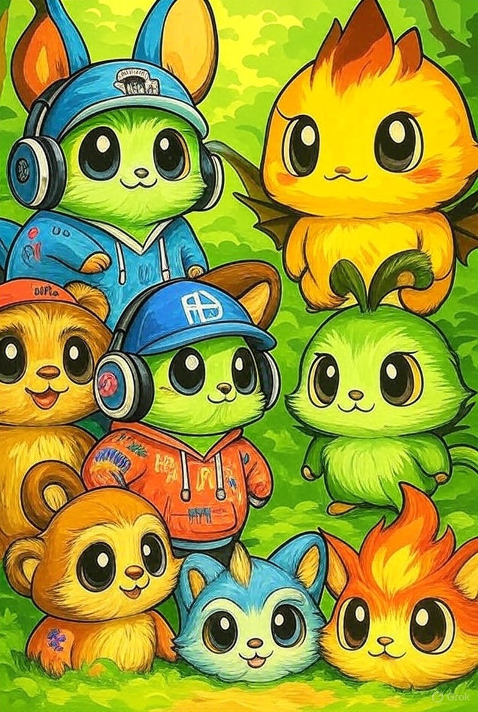
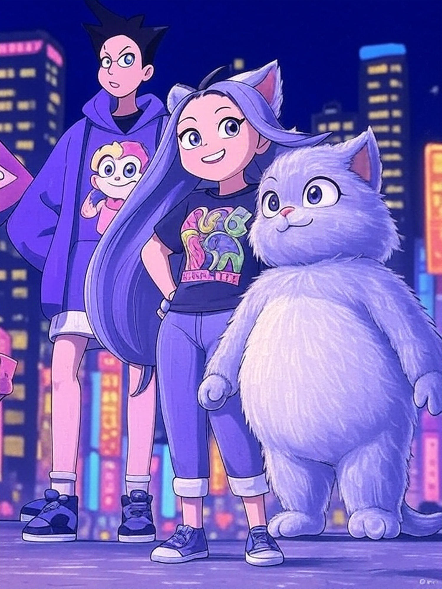

# ThisOrThat: The App That Makes Decisions Fun Again

## The Problem: Decision Paralysis is Real

Ever stood in front of your closet for 20 minutes trying to pick an outfit? Spent hours comparing products online only to buy nothing? Felt overwhelmed by the endless choices in our modern world? You're not alone. We live in an age of infinite options, and it's making us miserable. The average person makes 35,000 decisions per day, and most of them feel like work.

**Our Target: Gen Z and Millennial Decision-Makers**
ThisOrThat is built for the 18-35 demographic who grew up with social media but crave authentic connections. These are the fashion-conscious, tech-savvy users who post outfit checks on Instagram, compare products on TikTok, and value their friend groups' opinions. They're tired of endless scrolling and want quick, helpful decisions from people they actually trust.

## The Solution: This or That, That Simple

ThisOrThat turns decision-making into a game your friends play with you. Instead of agonizing over choices alone, you create a fun poll, share it with your crew, and let them help you decide. Two photos, 24 hours, and boom - you have your answer. No more endless scrolling through options. No more decision fatigue. Just simple, binary choices that actually get resolved.

## How It Works: Dead Simple, Seriously Fun

**Step 1: Create Your Poll**
Upload two photos or pick from our suggested icons. "Pizza or sushi for dinner?" "Red dress or blue dress?" "Should I get the iPhone or stick with Android?" The possibilities are endless, but the choice is always simple: This or That.

**Step 2: Share With Your Squad**
Send a link to your friends. No app downloads required for them - they just click and vote. Your poll is private to your friend group, so you get honest feedback without the pressure of public social media.

**Step 3: Watch the Magic Happen**
See real-time results as your friends vote. Read comments from your crew. In 24 hours, your poll closes and you have your answer. No more waffling, no more second-guessing.

## Why ThisOrThat is Different

**It's Actually Useful, Not Addictive**
Unlike other social apps designed to keep you scrolling forever, ThisOrThat solves a real problem and then gets out of your way. You use it when you need it, get your answer, and move on with your life.

**Your Friends, Not Strangers**
We're not trying to build another public social network. ThisOrThat is about your real friends helping you with real decisions. No influencers, no algorithms, no drama - just your crew helping you choose.

**Time Pressure That Actually Helps**
The 24-hour limit isn't arbitrary - it creates urgency that forces decisions. No more "I'll think about it" that turns into weeks of indecision. You get 24 hours, then you move forward.

**Characters That Care (Coming Soon)**
Why characters? Because our Gen Z and Millennial users grew up with Tamagotchi, Pokemon, and virtual pets. They're used to digital companions that have personality and react to their choices. Our characters will celebrate wins, commiserate with losses, and add personality to every decision - making the app feel more like a game and less like work. Think Tamagotchi meets decision-making, but this feature launches after our core polling platform is proven.

  
  

*Early character concepts - cute, furry companions that will react to your poll results*

## The MVP: What You'll Get First

**Web & Mobile Web App**
Start simple with a web app that works on any device. No app store downloads required - just go to ThisOrThat.com and start polling.

**Photo-Based Polls**
Upload two photos from your camera or photo library. Can't decide between two outfits? Snap pics and let your friends choose. Product comparison? Upload both and get instant feedback.

**Real-Time Results**
Watch votes come in live. See which option is winning, read comments from your friends, and enjoy the suspense as the 24-hour clock ticks down. (Character reactions and animations will be added in future updates.)

**Invite-Only Access**
Quality over quantity. ThisOrThat starts as an invite-only platform to ensure good content and real friendships. No spam, no bots, no weirdos - just you and your actual friends.

**Basic Safety Features**
Content moderation, reporting tools, and community guidelines keep things fun and safe. We're building a positive space for decision-making, not another toxic social media platform.

## The Vision: Where We're Going

**Character System & Partnerships**
Our target demographic loves digital companions - they've grown up with virtual pets, collectible characters, and interactive mascots. We're building a character system that makes decision-making feel like a game, with partnerships with anime, gaming, and entertainment brands. Imagine voting with your favorite characters from popular franchises - it's not just fun, it's familiar to our users who expect personality in their digital experiences.

**Smart Predictions**
Our AI will learn your friends' preferences and start predicting what they'll choose before they even vote. "Your friends are 85% likely to choose the red dress" - now that's helpful.

**Live Events Integration**
Watching the big game? Create a poll about who's going to win and see how your friends' predictions stack up against reality. Sports, TV shows, elections - turn any live event into a fun prediction game.

**Brand Insights**
Help brands understand what people really want through anonymous polling data. Your outfit choices help fashion brands make better products. Your food preferences help restaurants create better menus.

## The Business: Growth First, Money Later

We're not trying to get rich quick. ThisOrThat is about solving a real problem and building something people actually love. We'll focus on growth and user experience first, then figure out how to make money later. When we do monetize, it'll be through partnerships and value-added services, not by selling your data or showing you ads.

## Join the Movement

Decision paralysis is a modern epidemic, and ThisOrThat is the cure. Stop overthinking, start deciding, and have fun doing it. Your friends are waiting to help you choose.

**Early Adopter Program - Be the First to Decide**
We're building ThisOrThat with our community, not for them. Join our early adopter program to:

- **Get Early Access**: Be among the first to create polls when we launch
- **Shape the Product**: Share feedback on features, characters, and user experience
- **Build Your Squad**: Invite your friend group to be founding members
- **Influence Development**: Help us prioritize which features to build first

**Ready to Stop Overthinking?**
Sign up for our waitlist at [ThisOrThat.com/waitlist](https://ThisOrThat.com/waitlist) and be the first to know when we launch. Follow us on social media for behind-the-scenes development updates and early sneak peeks at our character designs.

_Coming soon to a browser near you - but you can get there first._
