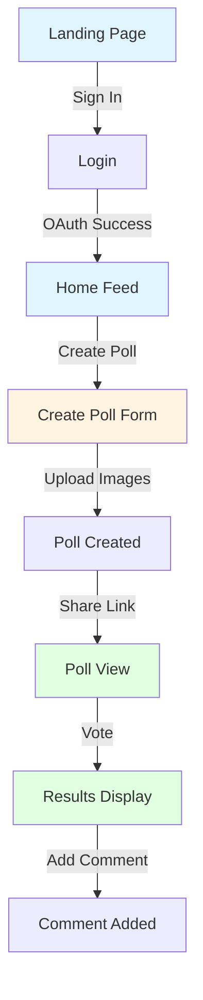
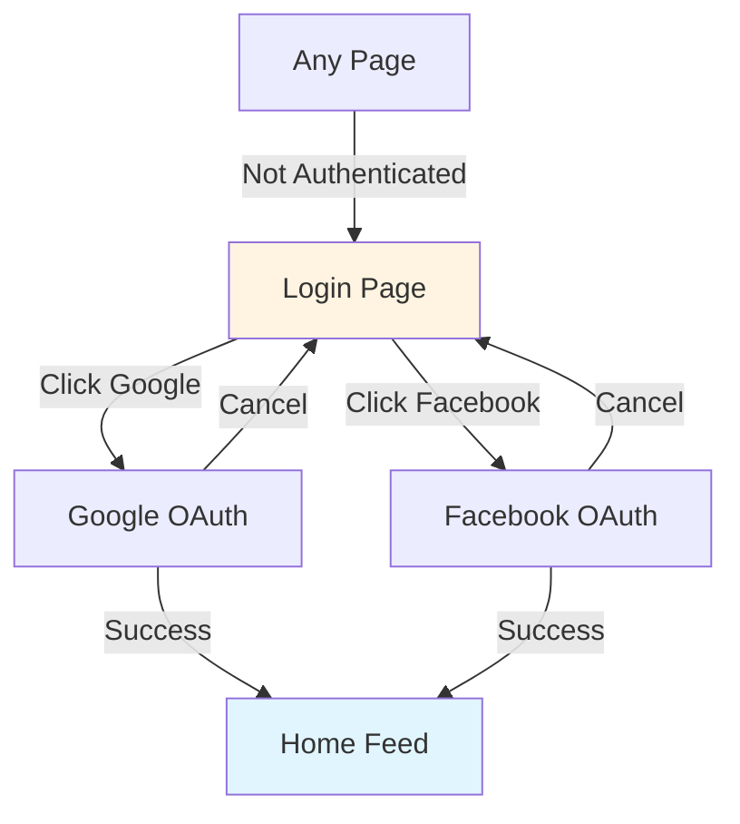
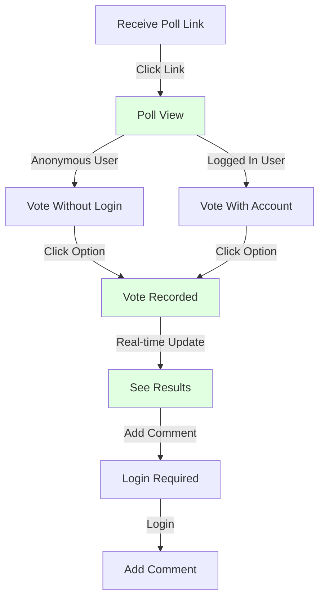

# ThisOrThat Wireframe Specifications

## Document Overview

This document provides detailed wireframe specifications for all screens in the ThisOrThat MVP. Each screen includes layout descriptions, component specifications, and interaction patterns.

**Target Platforms:** Web and Mobile Web (responsive design)

**Design Principles:**

- Mobile-first approach (Tailwind responsive design)
- Gamer aesthetic with playful, quirky design
- Simple, intuitive interactions
- Fast, responsive feedback
- Minimal cognitive load
- Utility-first CSS with Tailwind
- Component-based UI with Shadcn/ui

---

## Screen Inventory

### Public Screens (No Auth Required)

1. Landing Page
2. Poll View (Public Link)
3. Login Page

### Authenticated Screens

4. Home Feed
5. Create Poll
6. Poll Detail (Authenticated)
7. User Profile

---

## User Flows

### Primary User Flow: Poll Creation & Voting



### Authentication Flow



### Voting Flow



---

## Detailed Screen Specifications

## 1. Landing Page

**Purpose:** Introduce ThisOrThat and drive sign-ups

**URL:** `/`

**Layout:**

```
┌─────────────────────────────────────┐
│  [Logo] ThisOrThat    [Sign In]     │
├─────────────────────────────────────┤
│                                     │
│         Hero Section                │
│   "Stop Overthinking,               │
│    Start Deciding"                  │
│                                     │
│   [Get Started] [Learn More]       │
│                                     │
├─────────────────────────────────────┤
│                                     │
│    How It Works (3 steps)          │
│                                     │
│   [1] Create  [2] Share  [3] Vote  │
│                                     │
├─────────────────────────────────────┤
│                                     │
│    Example Poll Preview             │
│   (Animated demo of voting)         │
│                                     │
├─────────────────────────────────────┤
│                                     │
│    Features Section                 │
│   • Friend Groups                   │
│   • 24-Hour Polls                   │
│   • Real-Time Results               │
│                                     │
├─────────────────────────────────────┤
│                                     │
│    CTA: Join Waitlist               │
│   [Email Input] [Sign Up]           │
│                                     │
└─────────────────────────────────────┘
```

**Components:**

**Header:**

- Logo (left) - "ThisOrThat" with playful font
- Sign In button (right) - Primary CTA button

**Hero Section:**

- Large headline: "Stop Overthinking, Start Deciding"
- Subheadline: "Get instant feedback from your friends on any decision"
- Two CTAs: "Get Started" (primary), "Learn More" (secondary)
- Background: Subtle gradient with playful geometric shapes

**How It Works:**

- Three-column layout (mobile: stacked)
- Each step has an icon, title, and brief description
- Icons: Camera (Create), Link (Share), Checkmark (Vote)

**Example Poll Preview:**

- Animated demonstration of a poll
- Shows two options side-by-side
- Simulates voting and results updating
- Builds excitement and understanding

**Features Section:**

- Grid of key features with icons
- Each feature: icon, title, 1-sentence description
- Emphasizes friend groups, time pressure, real-time updates

**Footer CTA:**

- Email capture for waitlist
- Social proof (if available): "Join 1,000+ early adopters"

**Interactions:**

- Smooth scroll to sections
- Animated example poll
- Hover effects on buttons
- Responsive layout (mobile-first)

**Mobile Considerations:**

- Stack all sections vertically
- Full-width CTAs
- Simplified navigation (hamburger menu)

---

## 2. Login Page

**Purpose:** Authenticate users via OAuth

**URL:** `/login`

**Layout:**

```
┌─────────────────────────────────────┐
│  [← Back]                           │
│                                     │
│         [Logo/Icon]                 │
│                                     │
│    Welcome to ThisOrThat            │
│                                     │
│   Sign in to create polls and      │
│   help your friends decide          │
│                                     │
│   ┌───────────────────────────┐    │
│   │  🔵 Sign in with Google   │    │
│   └───────────────────────────┘    │
│                                     │
│   ┌───────────────────────────┐    │
│   │  📘 Sign in with Facebook │    │
│   └───────────────────────────┘    │
│                                     │
│   ─────────── or ───────────       │
│                                     │
│   Continue as Guest                │
│   (Limited features)                │
│                                     │
│                                     │
│   By signing in, you agree to      │
│   our Terms and Privacy Policy     │
│                                     │
└─────────────────────────────────────┘
```

**Components:**

**Header:**

- Back button (returns to previous page)
- Minimal, clean design

**Content Area:**

- Centered card layout
- Logo/mascot character at top
- Welcome headline
- Brief value proposition

**OAuth Buttons:**

- Large, prominent buttons
- Google button: Blue with Google logo
- Facebook button: Blue with Facebook logo
- Full-width on mobile
- Clear provider branding

**Guest Option:**

- Secondary action
- Explains limitations (can vote but not create polls)
- Styled as text link, not button

**Legal:**

- Small text at bottom
- Links to Terms and Privacy Policy

**Interactions:**

- Click OAuth button → Redirect to provider
- After auth → Redirect to Home Feed or return URL
- Loading state during OAuth flow
- Error handling for failed auth

**Mobile Considerations:**

- Full-screen layout
- Large touch targets for buttons
- Simplified copy

---

## 3. Home Feed

**Purpose:** Display polls from friend groups and public polls

**URL:** `/`

**Layout:**

```
┌─────────────────────────────────────┐
│  [☰] ThisOrThat  [+] [@Profile]    │
├─────────────────────────────────────┤
│                                     │
│  [Active] [Closed] [My Polls]      │
│                                     │
├─────────────────────────────────────┤
│  ┌─────────────────────────────┐   │
│  │  Poll Card 1                │   │
│  │  ┌──────┐  ┌──────┐         │   │
│  │  │ Img A│  │ Img B│         │   │
│  │  │      │  │      │         │   │
│  │  └──────┘  └──────┘         │   │
│  │  "Which outfit?"            │   │
│  │  ⏰ Closes in 18h  💬 12    │   │
│  └─────────────────────────────┘   │
│                                     │
│  ┌─────────────────────────────┐   │
│  │  Poll Card 2                │   │
│  │  ┌──────┐  ┌──────┐         │   │
│  │  │ Img A│  │ Img B│         │   │
│  │  │      │  │      │         │   │
│  │  └──────┘  └──────┘         │   │
│  │  "Pizza or Sushi?"          │   │
│  │  ⏰ Closes in 6h   💬 8     │   │
│  └─────────────────────────────┘   │
│                                     │
│  [Load More]                        │
│                                     │
└─────────────────────────────────────┘
```

**Components:**

**Header:**

- Hamburger menu (left) - Opens navigation drawer
- Logo/title (center)
- Create poll button "+" (right, prominent)
- Profile avatar (right)

**Filter Tabs:**

- Active: Polls still accepting votes
- Closed: Polls that have ended
- My Polls: Polls user created
- Active tab highlighted
- Horizontal scroll on mobile

**Poll Cards:**

- Two-column grid (desktop), single column (mobile)
- Each card shows:
  - Two option images side-by-side
  - Poll description/question
  - Time remaining (with urgency indicator)
  - Comment count
  - Creator avatar (small)
- Hover effect: Slight elevation
- Click anywhere on card → Poll Detail

**Empty State:**

- "No polls yet! Create your first poll"
- Large illustration
- CTA button to create poll

**Loading State:**

- Skeleton cards while loading
- Smooth fade-in when loaded

**Interactions:**

- Pull to refresh (mobile)
- Infinite scroll or "Load More" button
- Click card → Navigate to Poll Detail
- Click "+" → Navigate to Create Poll
- Tab switching updates content

**Mobile Considerations:**

- Single column layout
- Larger touch targets
- Swipe gestures for navigation
- Bottom navigation bar (optional)

---

## 4. Create Poll

**Purpose:** Create a new This or That poll

**URL:** `/poll/create`

**Layout:**

```
┌─────────────────────────────────────┐
│  [← Cancel]  Create Poll  [Done]   │
├─────────────────────────────────────┤
│                                     │
│  Step 1: Add Your Options           │
│                                     │
│  ┌─────────────────┐                │
│  │   Option A      │                │
│  │                 │                │
│  │  [📷 Upload]    │                │
│  │   Photo         │                │
│  │                 │                │
│  └─────────────────┘                │
│  [Label (optional)]                 │
│  ┌─────────────────────────────┐   │
│  │ Red dress                   │   │
│  └─────────────────────────────┘   │
│                                     │
│  ┌─────────────────┐                │
│  │   Option B      │                │
│  │                 │                │
│  │  [📷 Upload]    │                │
│  │   Photo         │                │
│  │                 │                │
│  └─────────────────┘                │
│  [Label (optional)]                 │
│  ┌─────────────────────────────┐   │
│  │ Blue dress                  │   │
│  └─────────────────────────────┘   │
│                                     │
├─────────────────────────────────────┤
│  Step 2: Add Details (Optional)     │
│                                     │
│  Description                         │
│  ┌─────────────────────────────┐   │
│  │ Which dress for the party?  │   │
│  │                             │   │
│  └─────────────────────────────┘   │
│                                     │
│  ☐ Make this poll public            │
│  (Anyone with link can vote)        │
│                                     │
├─────────────────────────────────────┤
│                                     │
│  [Create Poll]                      │
│                                     │
└─────────────────────────────────────┘
```

**Components:**

**Header:**

- Cancel button (left) - Confirms before discarding
- Title: "Create Poll"
- Done/Next button (right) - Validates before proceeding

**Option Upload Section:**

- Two large upload areas (Option A & B)
- Visual hierarchy: Images are the focus
- Upload states:
  - Empty: Dashed border, camera icon, "Upload Photo"
  - Uploading: Progress indicator
  - Uploaded: Show image with edit/remove icons
- Label input below each image
- Character limit indicator

**Image Upload Interaction:**

- Click to open file picker
- Drag & drop support (desktop)
- Camera access on mobile
- Image preview before upload
- Crop/rotate tools (optional)
- Max file size: 5MB
- Accepted formats: JPG, PNG, WebP

**Details Section:**

- Collapsible/expandable (optional)
- Description textarea (500 char limit)
- Character counter
- Public/private toggle
- Helper text explaining privacy

**Validation:**

- Both images required
- Labels optional but recommended
- Real-time validation feedback
- Error messages inline

**Create Button:**

- Large, prominent CTA
- Disabled until valid
- Loading state during creation
- Success animation

**Interactions:**

- Auto-save draft (localStorage)
- Confirm before cancel if changes made
- Smooth transitions between steps
- Success → Redirect to poll detail

**Mobile Considerations:**

- Full-screen layout
- Large upload targets
- Native camera integration
- Simplified form layout
- Bottom-fixed Create button

---

## 5. Poll Detail (Authenticated)

**Purpose:** View poll, vote, see results, and comment

**URL:** `/poll/[id]`

**Layout (Before Voting):**

```
┌─────────────────────────────────────┐
│  [← Back]    Poll    [⋮ Menu]       │
├─────────────────────────────────────┤
│                                     │
│  Created by @username               │
│  ⏰ Closes in 18 hours              │
│                                     │
│  "Which outfit for the party?"      │
│                                     │
│  ┌──────────────┐  ┌──────────────┐│
│  │              │  │              ││
│  │   Option A   │  │   Option B   ││
│  │              │  │              ││
│  │   [Image]    │  │   [Image]    ││
│  │              │  │              ││
│  │              │  │              ││
│  │ Red dress    │  │ Blue dress   ││
│  │              │  │              ││
│  │   [Vote A]   │  │   [Vote B]   ││
│  └──────────────┘  └──────────────┘│
│                                     │
│  👥 12 votes so far                 │
│                                     │
├─────────────────────────────────────┤
│  💬 Comments (8)                    │
│                                     │
│  ┌─────────────────────────────┐   │
│  │ @friend1: Love the red! 🔥  │   │
│  │ 2 hours ago                 │   │
│  └─────────────────────────────┘   │
│                                     │
│  ┌─────────────────────────────┐   │
│  │ @friend2: Blue is more you  │   │
│  │ 5 hours ago                 │   │
│  └─────────────────────────────┘   │
│                                     │
│  [Add a comment...]                 │
│                                     │
└─────────────────────────────────────┘
```

**Layout (After Voting):**

```
┌─────────────────────────────────────┐
│  [← Back]    Poll    [⋮ Menu]       │
├─────────────────────────────────────┤
│                                     │
│  Created by @username               │
│  ⏰ Closes in 18 hours              │
│                                     │
│  "Which outfit for the party?"      │
│                                     │
│  ┌──────────────┐  ┌──────────────┐│
│  │              │  │              ││
│  │   Option A   │  │   Option B   ││
│  │              │  │              ││
│  │   [Image]    │  │   [Image]    ││
│  │              │  │              ││
│  │              │  │              ││
│  │ Red dress    │  │ Blue dress   ││
│  │              │  │              ││
│  │ ✓ You voted  │  │              ││
│  │              │  │              ││
│  │ ████████ 67% │  │ ███░ 33%     ││
│  │ 8 votes      │  │ 4 votes      ││
│  └──────────────┘  └──────────────┘│
│                                     │
│  [Change Vote]                      │
│                                     │
├─────────────────────────────────────┤
│  💬 Comments (8)                    │
│  ...                                │
└─────────────────────────────────────┘
```

**Components:**

**Header:**

- Back button (left)
- Title: "Poll"
- Menu button (right) - Share, Report, Delete (if owner)

**Poll Info:**

- Creator name with avatar
- Time remaining (with urgency indicator)
- Poll description/question
- Status badge (Active/Closed)

**Poll Options (Before Vote):**

- Two-column layout (equal width)
- Large, high-quality images
- Option labels below images
- Vote buttons prominent
- Hover effect on options
- Tap to zoom images (mobile)

**Poll Options (After Vote):**

- User's choice highlighted
- Visual indicator (checkmark, border)
- Progress bars showing percentages
- Vote counts displayed
- Animated reveal of results
- Option to change vote

**Vote Counts:**

- Total votes displayed
- Real-time updates
- Smooth animations when counts change

**Comments Section:**

- Scrollable list of comments
- Each comment shows:
  - User avatar
  - Username
  - Comment text
  - Timestamp
  - Like/reply buttons (future)
- Input field at bottom
- Character limit (500)
- Real-time updates

**Menu Options:**

- Share poll (copy link, social media)
- Report poll (if inappropriate)
- Delete poll (if creator)
- Edit poll (if creator, before votes)

**Interactions:**

- Click vote button → Optimistic update → Server confirmation
- Real-time vote updates via Supabase Realtime
- Click image → Full-screen view
- Add comment → Real-time append
- Pull to refresh (mobile)
- Share sheet integration (mobile)

**States:**

- Loading: Skeleton UI
- Voted: Show results with user's choice
- Not voted: Show vote buttons
- Closed: Show final results, disable voting
- Error: Show error message with retry

**Mobile Considerations:**

- Stack options vertically for better image viewing
- Full-width vote buttons
- Bottom sheet for comments
- Native share integration
- Swipe gestures (back, share)

---

## 6. Poll Detail (Anonymous/Public Link)

**Purpose:** Allow anyone with link to view and vote

**URL:** `/poll/[id]` (no auth)

**Layout:**

```
┌─────────────────────────────────────┐
│  ThisOrThat Logo    [Sign In]       │
├─────────────────────────────────────┤
│                                     │
│  ⏰ Closes in 18 hours              │
│                                     │
│  "Which outfit for the party?"      │
│                                     │
│  ┌──────────────┐  ┌──────────────┐│
│  │              │  │              ││
│  │   Option A   │  │   Option B   ││
│  │              │  │              ││
│  │   [Image]    │  │   [Image]    ││
│  │              │  │              ││
│  │              │  │              ││
│  │ Red dress    │  │ Blue dress   ││
│  │              │  │              ││
│  │   [Vote A]   │  │   [Vote B]   ││
│  └──────────────┘  └──────────────┘│
│                                     │
│  👥 12 votes so far                 │
│                                     │
├─────────────────────────────────────┤
│                                     │
│  💬 Sign in to comment              │
│  [Sign In with Google]              │
│                                     │
├─────────────────────────────────────┤
│                                     │
│  Want to create your own polls?     │
│  [Get Started]                      │
│                                     │
└─────────────────────────────────────┘
```

**Differences from Authenticated View:**

**Header:**

- Logo instead of back button
- Prominent "Sign In" button
- No menu options

**Voting:**

- Can vote anonymously
- Vote stored via cookie/localStorage
- Results shown after voting
- Cannot change vote without signing in

**Comments:**

- Cannot view comments (or limited view)
- CTA to sign in to comment
- Shows comment count only

**Footer CTA:**

- Encourages sign-up
- "Create your own polls"
- Link to landing page

**Interactions:**

- Vote works without auth
- Cookie-based vote tracking
- Prompt to sign in for full features
- Share button available

---

## 7. User Profile

**Purpose:** View user's polls and settings

**URL:** `/profile`

**Layout:**

```
┌─────────────────────────────────────┐
│  [← Back]    Profile    [⚙️ Settings]│
├─────────────────────────────────────┤
│                                     │
│        [Avatar]                     │
│      @username                      │
│   user@email.com                    │
│                                     │
│  ┌─────┐ ┌─────┐ ┌─────┐           │
│  │ 24  │ │ 156 │ │ 89  │           │
│  │Polls│ │Votes│ │Helps│           │
│  └─────┘ └─────┘ └─────┘           │
│                                     │
├─────────────────────────────────────┤
│  [My Polls] [Voted On] [Saved]     │
├─────────────────────────────────────┤
│                                     │
│  ┌─────────────────────────────┐   │
│  │  Poll Card 1                │   │
│  │  ┌──────┐  ┌──────┐         │   │
│  │  │ Img A│  │ Img B│         │   │
│  │  └──────┘  └──────┘         │   │
│  │  "Which outfit?"            │   │
│  │  ✓ Closed  💬 12  👁️ 45    │   │
│  └─────────────────────────────┘   │
│                                     │
│  ┌─────────────────────────────┐   │
│  │  Poll Card 2                │   │
│  │  ...                        │   │
│  └─────────────────────────────┘   │
│                                     │
└─────────────────────────────────────┘
```

**Components:**

**Header:**

- Back button
- Title: "Profile"
- Settings icon (right)

**Profile Info:**

- Large avatar (editable)
- Username
- Email address
- Edit profile button

**Stats:**

- Three-column grid
- Polls created
- Total votes received
- Times helped friends (votes given)
- Animated counters

**Tabs:**

- My Polls: Polls user created
- Voted On: Polls user voted on
- Saved: Bookmarked polls (future)

**Poll List:**

- Same card design as Home Feed
- Shows poll status (Active/Closed)
- Stats: comments, views
- Click → Poll Detail

**Settings (Separate Page/Modal):**

- Account settings
- Notification preferences
- Privacy settings
- Delete account
- Sign out

**Interactions:**

- Edit avatar → Upload new image
- Click stats → Filtered view
- Tab switching
- Pull to refresh

**Mobile Considerations:**

- Simplified stats layout
- Bottom navigation
- Swipe between tabs

---

## Component Library

### Reusable Components

#### Button Styles

**Primary Button:**

- Background: Bright, energetic color (e.g., #FF6B6B)
- Text: White, bold
- Border radius: 12px
- Padding: 16px 32px
- Hover: Slightly darker, subtle lift
- Active: Scale down slightly

**Secondary Button:**

- Background: Transparent
- Border: 2px solid primary color
- Text: Primary color
- Same dimensions as primary

**Ghost Button:**

- Background: Transparent
- No border
- Text: Gray
- Hover: Light gray background

#### Card Component

```
┌─────────────────────────────┐
│  [Header with icon]         │
├─────────────────────────────┤
│                             │
│  Content area               │
│                             │
├─────────────────────────────┤
│  [Footer with actions]      │
└─────────────────────────────┘
```

- Border radius: 16px
- Shadow: Subtle elevation
- Padding: 16px
- Hover: Increase shadow
- Transition: Smooth

#### Input Field

- Border: 2px solid light gray
- Border radius: 8px
- Padding: 12px 16px
- Focus: Primary color border
- Error: Red border + message below
- Success: Green border + checkmark

#### Avatar

- Circular
- Sizes: Small (32px), Medium (48px), Large (96px)
- Fallback: Initials with colored background
- Border: Optional white border

---

## Design System (Tailwind Configuration)

### Colors (Tailwind Palette)

**Primary Palette:**

- Primary: #FF6B6B (Coral Red - energetic, playful) - `bg-primary-500`
- Secondary: #4ECDC4 (Turquoise - friendly, modern) - `bg-secondary-500`
- Accent: #FFE66D (Yellow - attention, urgency) - `bg-accent-500`

**Neutral Palette:**

- Background: #FFFFFF - `bg-white`
- Surface: #F7F7F7 - `bg-gray-50`
- Border: #E0E0E0 - `border-gray-300`
- Text Primary: #2D3748 - `text-gray-800`
- Text Secondary: #718096 - `text-gray-600`

**Status Colors:**

- Success: #48BB78 - `bg-green-500`
- Warning: #ECC94B - `bg-yellow-400`
- Error: #F56565 - `bg-red-500`
- Info: #4299E1 - `bg-blue-500`

**Tailwind Config Example:**

```js
colors: {
  primary: {
    500: '#FF6B6B',
  },
  secondary: {
    500: '#4ECDC4',
  },
  accent: {
    500: '#FFE66D',
  }
}
```

### Typography

**Font Family (Tailwind):**

- Primary: Inter or similar modern sans-serif - `font-sans`
- Headings: Poppins or similar playful font - `font-display`

**Font Sizes (Tailwind Classes):**

- H1: 32px (mobile: 24px) - `text-3xl md:text-4xl`
- H2: 24px (mobile: 20px) - `text-xl md:text-2xl`
- H3: 20px (mobile: 18px) - `text-lg md:text-xl`
- Body: 16px - `text-base`
- Small: 14px - `text-sm`
- Tiny: 12px - `text-xs`

**Font Weights (Tailwind Classes):**

- Regular: 400 - `font-normal`
- Medium: 500 - `font-medium`
- Semibold: 600 - `font-semibold`
- Bold: 700 - `font-bold`

### Spacing (Tailwind Scale)

**Base Unit:** 4px (Tailwind default)

**Scale (Tailwind Classes):**

- xs: 4px - `p-1` / `m-1`
- sm: 8px - `p-2` / `m-2`
- md: 16px - `p-4` / `m-4`
- lg: 24px - `p-6` / `m-6`
- xl: 32px - `p-8` / `m-8`
- 2xl: 48px - `p-12` / `m-12`
- 3xl: 64px - `p-16` / `m-16`

### Border Radius (Tailwind Classes)

- Small: 4px - `rounded` (inputs, tags)
- Medium: 8px - `rounded-lg` (buttons, cards)
- Large: 16px - `rounded-2xl` (modals, large cards)
- Round: 50% - `rounded-full` (avatars, icons)

### Shadows (Tailwind Classes)

- Small: `shadow-sm` - 0 1px 2px rgba(0,0,0,0.05)
- Medium: `shadow-md` - 0 4px 6px rgba(0,0,0,0.1)
- Large: `shadow-xl` - 0 20px 25px rgba(0,0,0,0.15)

---

## Responsive Breakpoints (Tailwind)

**Mobile:** 0 - 640px (default, no prefix)

- Single column layouts
- Bottom navigation
- Full-width components
- Larger touch targets (min 44px)

**Tablet:** 641px - 1024px (`md:` prefix)

- Two-column layouts where appropriate
- Side navigation
- Optimized for touch and mouse

**Desktop:** 1025px+ (`lg:` prefix)

- Multi-column layouts
- Hover states
- Keyboard shortcuts
- Max content width: 1200px (`max-w-7xl`)

**Tailwind Examples:**

```html
<!-- Mobile: full width, Desktop: max width -->
<div class="w-full lg:max-w-7xl">
  <!-- Mobile: single column, Tablet: 2 columns, Desktop: 3 columns -->
  <div class="grid grid-cols-1 md:grid-cols-2 lg:grid-cols-3">
    <!-- Mobile: stack, Desktop: flex row -->
    <div class="flex flex-col lg:flex-row"></div>
  </div>
</div>
```

---

## Interaction Patterns

### Loading States

**Skeleton Screens:**

- Use for initial page loads
- Animate shimmer effect
- Match layout of actual content

**Spinners:**

- Use for button actions
- Small, inline spinners
- Replace button text during loading

**Progress Bars:**

- Use for file uploads
- Show percentage
- Smooth animation

### Empty States

**No Polls:**

- Large illustration
- Encouraging message
- Clear CTA to create first poll

**No Comments:**

- Simple message
- "Be the first to comment"

**No Results:**

- "No polls found"
- Suggest creating one or adjusting filters

### Error States

**Network Error:**

- Friendly message
- Retry button
- Offline indicator

**Not Found:**

- 404 page with illustration
- Link back to home
- Search functionality

**Permission Denied:**

- Clear explanation
- Action to resolve (e.g., sign in)

### Success States

**Poll Created:**

- Success animation
- Share options immediately
- View poll button

**Vote Recorded:**

- Immediate visual feedback
- Confetti or celebration animation
- Show results

**Comment Added:**

- Smooth append to list
- Highlight new comment briefly

---

## Accessibility Considerations

### WCAG 2.1 AA Compliance

**Color Contrast:**

- Text: Minimum 4.5:1 ratio
- Large text: Minimum 3:1 ratio
- Interactive elements: Clear focus states

**Keyboard Navigation:**

- All interactive elements focusable
- Logical tab order
- Visible focus indicators
- Keyboard shortcuts for common actions

**Screen Readers:**

- Semantic HTML
- ARIA labels where needed
- Alt text for images
- Skip navigation links

**Touch Targets:**

- Minimum 44x44px
- Adequate spacing between targets
- Clear active states

---

## Animation Guidelines

### Timing

**Fast:** 150ms - Hover effects, button presses
**Medium:** 300ms - Page transitions, modals
**Slow:** 500ms - Complex animations, celebrations

### Easing

- Ease-out: For entrances
- Ease-in: For exits
- Ease-in-out: For movements

### Principles

- Purposeful: Every animation should serve a purpose
- Subtle: Don't distract from content
- Consistent: Use same timing/easing throughout
- Performant: Use transform and opacity for smooth 60fps

---

## Next Steps

1. **Review & Feedback:** Share wireframes with stakeholders
2. **High-Fidelity Mockups:** Create detailed designs in Figma/Sketch
3. **Prototype:** Build interactive prototype for user testing
4. **User Testing:** Validate designs with target users
5. **Iterate:** Refine based on feedback
6. **Handoff:** Prepare design specs for development

---

## Notes

- These wireframes focus on MVP features only
- Character system not included (post-MVP)
- Advanced features (AI predictions, live events) not shown
- Design should feel playful and fun, not corporate
- Mobile-first approach is critical
- Real-time updates are a key differentiator
